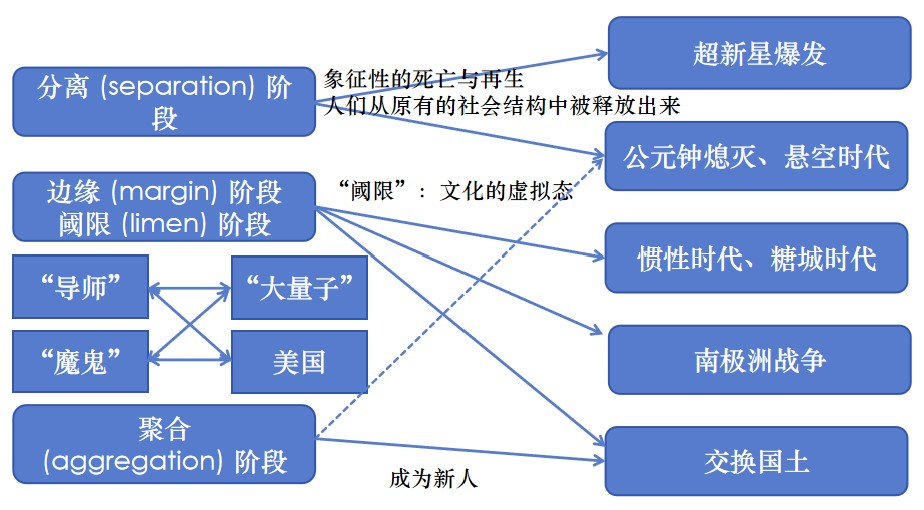

# 一代人的成人礼：人类学视阈下的《超新星纪元》

注：本文也发表在交大幻协社刊上。

摘要：本研究采用科幻人类学视角深入分析刘慈欣的科幻小说《超新星纪元》，探讨了作品中的成人仪式元素及其对现代社会的隐喻。研究指出，《超新星纪元》既是科幻小说，也是成长小说，文本中儿童在超新星灾变后成长为成人的过程象征性地体现出人类学中“成人仪式”的结构。特别地，本研究通过文本细读的方式解码《超新星纪元》中的“三次成人仪式”，并将其与现代社会中的教育和家庭结构变迁相联系，展示了科幻文学在反映社会认知中的作用。同时，本研究梳理了《超新星纪元》中成人-儿童这组权力关系的流变，并分析了文本中成人视角对儿童的想象认知与儿童实际视角之间的差异和张力。本研究认为，《超新星纪元》不仅是科幻小说和成长小说的结合，更是对现代社会中“成人仪式”的反思与重构，具有重要的文化和教育意义。综上所述，本研究使用科幻人类学的视角与方法分析《超新星纪元》中的“成人仪式”元素，为理解《超新星纪元》文本与以《超新星纪元》为代表的科幻文学提供了新的视角，并对如何培养未来的“新人”提出了深刻的思考。

## 一、《超新星纪元》文本类型的双重性与人类学内涵

在刘慈欣的文学创作体系中，《超新星纪元》是一个特殊的存在。它虽然属于科幻小说的范畴，却罕见地将叙事焦点放置于儿童群体之上，书写了一部独属于儿童与少年的未来史诗。

从文学类型的视角分析，《超新星纪元》兼具成长小说与科幻小说的双重属性。作为一部成长小说，其叙事视角集中于儿童群体，以及他们从孩童阶段向成年阶段过渡的过程，象征性地展现了儿童社会化的过程。而作为科幻小说，作品中的“超新星”元素作为科学概念出现，而“纪元”则体现了文本的虚构性与幻想性，作品也就具有了虚构史与民族志的特点。

基于《超新星纪元》文体类型的双重性，本研究旨在挖掘其文本中蕴含的人类学内涵。在文学人类学的研究领域中，成长小说常被视为人类学中的“成人仪式”在文学中的再现。人类学研究揭示，许多原始民族中存在着为未成年人举行的成人仪式，其中包括象征个人或群体从原有状态中脱离的“分离阶段”，以及通过仪式参与，使个体重新获得稳定状态，并在社会中获得结构性定义、权利与任务的“聚合阶段”，以及两者之间的“边缘阶段”或“阈限阶段”[^1]。成人仪式的实施有助于维持社会的基本结构，并传承基本价值观。在现代社会中，教育逐渐取代了成人仪式的功能，但成人仪式作为一种神话原型，在现代成长小说中依然存在，并反映了现代人心理中的无意识欲望[^2]。

而从文学人类学的视角看科幻小说，大致有以下两种进路[^3]。其一是人类学的科幻文学研究。藉由神话原型批评等批评范式，可以将科幻文学还原到总体文学的动态结构之中。其二是科幻文学的人类学研究。这一进路强调对文学作品中人类学因素的发掘，并将科幻文学作为人类认知的民族志、想象的民族志、精神的民族志来看待。此外，科幻小说文本中的“科学”元素，也可类比为文学人类学研究中的“仪式”与“器物”，可以作为一种文化文本进行人类学解读。

处于成长小说与科幻小说交界处的《超新星纪元》，因而具备了丰富的人类学内涵。本文从《超新星纪元》文体类型的的双重性和人类学内涵入手，采用文本细读的方法，提取作品中的“成人仪式”元素，并利用“过渡仪式”、“阈限”等人类学理论，将其归纳为“三次成人仪式”。在发掘文本中的“成人仪式”原型之后，本文将文本视为一种人类学民族志，探讨文本中“超新星灾变”与“成人礼”的现实意义。在此之后，本文借助《写文化》中的观点，反思《超新星纪元》文本作为民族志的“虚拟性”，并通过回顾《超新星纪元》文体类型的双重性分析文本中呈现出的“成人-孩子”权力关系的建构与流变。

## 二、《超新星纪元》中的三次成人仪式

### 三次成人仪式的划分

在《超新星纪元》的叙事框架中，成人仪式的划分可以被理解为三个相互关联的阶段，每个阶段都隐含了“成人仪式”的结构。

超新星爆发标志着“第一代人”的成人仪式的开始。在这一阶段中，由于超新星带来的致命射线，12岁以上的成人面临死亡的威胁，而孩子们被迫迅速承担起成人的角色和责任。成人们在有限的时间内，对孩子们进行了密集的教育和训练，以确保他们能够接管世界并生存下去。

在“第一代人”成长为成人并开始拥有自己的孩子之后，他们也对下一代进行了类似“成人仪式”的教育。而从整体上看，《超新星纪元》文本本身的结构也隐含了成人仪式的元素。从超新星爆发导致成人死亡的悲剧开始，到孩子们成长为能够承担起社会责任的成人结束，整个叙事结构呈现了一个完整的成人仪式周期。这个周期不仅涵盖了个体的成长，也反映了社会和文化的“成长”。

通过上述分析，可以将《超新星纪元》的文本划分为三次成人仪式：超新星爆发后“第一代人”的“成人仪式”，超新星爆发后“第二代人”的“成人仪式”，以及超新星纪元历史中隐含的“成人仪式”的结构。

<figcaption>三次“成人仪式”</figcaption>

### “第一代人”的“成人仪式”：不彻底的成人仪式

在《超新星纪元》中，孩子们的首次出场是在小学班级的毕业晚会上，而超新星爆发的余波在此时到达地球[^4]。这象征他们即将从儿童阶段过渡到成人阶段，而“素质教育”“毕业晚会”“理想教育”等语词的出现则构建出一场理性的、有序化的教育的一部分的“成人仪式”。

内含于现代教育中的“成人仪式”本应在从儿童到成人的不同年龄阶段循序渐进地展开，但超新星的爆发却加速了孩子们“成人仪式”的进行。在成人的引导下，孩子们的“成人”被迫开始了。

从超新星爆发到成人们尽数死亡的情节中，可以提取出人类学中“成人仪式”的诸多元素。“模拟国家”[^5]的情节，可以看作是成人仪式中远离家庭特别是母亲，并经历磨难和考验的“分离阶段”；而“大学习”[^6]的情节则与成人仪式中学习生存所需知识的“阈限阶段”相呼应。然而，使得“成人仪式”结构最终闭合的“聚合阶段”却出现了缺失。

在“大学习”过程中，孩子们虽然学习了“人类生存所必须的所有技能”和“运行世界的基本能力”，但“最难学的东西是成熟”，这种成熟是“教不会的”[^7]。这表明，成人礼中的文化习得和社会化过程在“第一代人”的成人礼中并未完全实现。对技术和技能学习的过度重视，以及对民族神话、历史、习俗与价值观学习的忽视，使得“第一代人”的“成人礼”成为了不彻底的成人仪式。这种不彻底的成人仪式无法有效激发独立意识并编织共同的集体意识，也就引发了后续情节中孩子们面临的现实危机与精神危机。

### “第二代人”的“成人仪式”：灾变的回响

《超新星纪元》的结尾处，孩子们已然长成成人。虽然文本并未详细描述成人后的孩子们如何教育其后代，但通过书中穿插的插叙，我们可以捕捉到孩子们成年后对“第二代人”进行教育和成人仪式的轮廓。

超新星灾变对“第二代人”的成人仪式产生了深远的影响，这一仪式以“复活节”[^8]的形式呈现，具有强烈的象征意义。在这一天，十一岁以下的孩子们在学校集合，在学校独立生活一天一夜，自己做饭、洗衣服，并照顾更年幼的孩子。“复活节”象征着从灾难中恢复和重生，它在这里并没有宗教含义，而是人们心中“国家从超新星的灾难中真正复活的时刻”，参与并构建了“第二代人”的民族记忆与集体认同。

“第二代人”的“成人仪式”也内含了成人仪式的元素。最显著的是“复活节”这一名词内蕴的“死亡与复活”的结构以及“与成人隔离”“经历考验”等元素的出现。与成人们引导下的“第一代人”的“成人仪式”不同，“第二代人”的“成人仪式”更加注重儿童的社会化与集体意识的编织。在少先队队旗下分组和照顾更年幼孩子的活动，不仅是对孩子们独立性的考验，也是他们学习团队合作和社会责任感的过程，它既意味着个体从儿童到成人的转变，也是孩子们融入社会、承担社会责任的开始。

### 超新星纪元历史中隐含的“成人仪式”的结构

如果把科幻看作构成文学整体回流神话传统[^9]的一环，那么在科幻文本中寻找“成人仪式”的结构就有了理论依凭。而与传统文学中个体成长的故事不同，《超新星纪元》中的成人过程是集体性的，涉及整个种族的成长和转变。刘慈欣在《从大海见一滴水》中提出，在科幻小说中，人物形象的概念有两个扩展方向：一是用整个种族的形象取代个体形象，二是将一个世界作为一个形象来呈现[^10]。他的小说也确实如他所言：《超新星纪元》以史诗的方式展开，交错穿插不同孩子的视角，从不同侧面展现中国孩子作为一个整体在宏观上的成长过程。

基于这一理论视角，我们可以将《超新星纪元》中的中国孩子们视为一个整体，在“超新星纪元”的历史中发掘与他们“成人仪式”相关的结构。

<figcaption>超新星纪元历史中隐含的“成人仪式”结构</figcaption>

#### （1）“成人仪式”的前奏：超新星意象的神话学分析

在对“超新星纪元史”整体进行分析时，“超新星爆发”便可视为这场“成人仪式”的前奏。因此，首先对“超新星”这一意象进行神话学分析。

在中国古代文献中，超新星被描绘为一种无常出现的“客星”。在《观象玩占》中，其特性为“无恒时之出，无定所之居”，表现为“忽见忽没，或行或止，不可推算”，隐喻未来的不确定性。在《开元占经》中，类似《超新星纪元》中描述的“玫瑰星云”，红色的“客星”被视作战争的不祥征兆。

在科幻文学的语境中，超新星意象亦承载着独特的内涵。在阿瑟·克拉克的小说《星》中，超新星既是毁灭文明的灾难象征，同时又是预示耶稣诞生的伯利恒之星，于是“超新星”的意象也就被赋予了毁灭与希望的双重含义。

综上所述，超新星意象蕴含着“不确定性”、“毁灭”与“新生”。这一意象在小说中可被解读为中国孩子们作为一个整体从“幼年”向“成年”过渡时所经历的精神危机，象征着成人仪式的序幕。

#### （2）“成人仪式”中的“分离阶段”：公元钟与悬空时代

紧随“超新星爆发”而来的便是前文所述的“第一代人”的“成人仪式”。成人们全部离开孩子们前往终聚地后，“超新星纪元史”作为“成人仪式”的叙事便正式展开。通过分析“公元钟”的象征意义和随后的“悬空时代”，我们可以揭示出其中暗含的“分离阶段”的结构。

在文本中，“公元钟”是一个像素构成的“绿色长方形”[^11]，每个像素代表终聚地中一个成年人的存活状态。当像素从绿色变为黑色时，这象征着终聚地中的成年人已经全部离世。“生物死亡并不算是真正的死亡，必须通过种种仪式使尸体转化为某一恰当的逝世者”[^12]。“公元钟”的熄灭过程正是这样的仪式。随着成年人的相继离世，“公元钟”逐渐从代表生命的绿色变作“死亡熔岩”般的黑色，这一视觉转变象征着孩子们与“成人时代”的逐渐分离，构成了“分离阶段”的一部分。

当公元钟完全熄灭，孩子们便进入了“悬空时代”[^13]。得知与“成人时代”彻底分离的事实引发了孩子们的精神危机，随即造成整个社会的混乱与失序。这种混乱与失序既是“公元钟熄灭”的直接结果，也表明着孩子们正从成人们构建的社会结构与生活秩序中脱离，渴望着庇护与集体，也渴望着新的社会结构与新的生活环境，是“分离阶段”在中国孩子“成人仪式”中的具体体现。

#### （3）“成人仪式”中的“导师”形象：大量子

在中国孩子们经历混乱与失序的“分离阶段”时，“成人仪式”中的“导师”形象登场了。它是“中华量子220的主机升级产品”，实体形式是“一方一圆两个几何体”。在通电之后的“不到五分钟的时间内”，它“从婴儿长成了巨人”，通过数字国土，“它的眼睛遍布全国”，被孩子们称作“大量子”[^14]。在文本中，“大量子”作为超级计算机，既是“成人时代”的遗存，也是科学技术的化身。

当孩子们处于混乱和失序之中时，大量子使用超算能力为每个孩子定制了“针对个人的精神依靠”[^15]，协助孩子们平复“分离阶段”的社会混乱，“让孩子们知道国家的存在”。通过技术的介入，孩子们逐渐从混乱中恢复，找回自己在社会结构中的位置。尽管这一位置仍然是“成人时代”所赋予的，但从某种意义上说，这一过程可以被视为由技术驱动的“成人仪式”中的“聚合阶段”。

然而，“大量子”真的能胜任孩子们成人仪式中的“导师”？正如“第一代人”的“成人仪式”是不彻底的一样，“大量子”利用技术促成“聚合阶段”仍旧是不彻底的。在人类学中，“成人仪式”中的导师通常负责传授文化、习俗、价值观和道德，而“大量子”仅仅解决了物质层面的社会混乱，未能提供精神层面的庇护和引导。因此，作为技术的化身，“大量子”并不是一位合格的“导师”。

在后续情节中，“大量子”还利用其计算能力开发出“数字国土”的“大会模式”[^16]。在这一模式下，“大量子”“把两亿孩子的发言归纳为一条发言”，实现了“一个对象与上亿个对象同时对话”的壮观场景。然而，尽管“大会模式”在信息汇总方面表现出色，但却无法在价值观层面为孩子们提供建议或指导。在《超新星纪元》的一个早期版本中，通过“大会模式”制定的国家政策最终导致孩子们陷入断水少粮的危急境地[^17]。如此看来，“大量子”虽然具有超级算力，却不具备超级智能，更难以胜任“导师”的角色，甚至还有可能将中国孩子们引入歧途。于是，作为“导师”的“大量子”也同时具有了“魔鬼”的双重形象。

#### （4）“成人仪式”中的“阈限阶段”

尽管“大量子”作为“导师”形象帮助孩子们从“悬空时代”的混乱状态中初步解脱，但孩子们显然不满于成人们安排好的社会结构。他们期待玩乐，期待一个“好玩儿”的世界。他们渴望与旧的社会结构与文化状态彻底断裂，但又并未找到新的社会结构和文化状态。于是，“超新星纪元”进入了“阈限阶段”。

在“阈限阶段”中，主体的特征不能也不可能是清晰的，它“从类别的网状结构中躲避或逃逸出去”[^18]，展现出不清晰、不确定的特点。这一阶段也可以被理解为一个历史时期，其中“过去已经丧失控制，而未来尚未明确成型”，“文化的虚拟态”占据主要地位，历史常常以游戏、想象与矛盾等形式展开，而个体在其中获得自我反思并可能产生顿悟[^19]。同时，在“阈限阶段”中，传统的社会关系解体，社会呈现出一种无组织或仅有基本组织结构的状态，缺乏差异，表现为一致性和平等性，没有明确的命名和财产区分[^20]。这样的社会也就具有了“交融”的许多性质。

“阈限阶段”的概念适用于描述《超新星纪元》中的几个关键时期，包括“惯性时代”、“糖城时代”和“南极洲战争”。

“悬空时代”之后，孩子世界继续沿着“成人时代”的轨迹发展。然而，在“大量子”的“数字国土”之上，孩子们却构想着与现实截然不同的“五年计划”[^21]。他们将欲望投射到数字国土的开发区之中，建造“巨型游乐设施”“游戏机区”“动物园区”“探险区”与“糖城开发区”。“惯性时代”中孩子们的幻想可视为“阈限时期”“历史以想象的形式展开”的表现。

在“糖城时代”中的“美梦时期”[^22]，孩子们沉迷于商店中的玩具，并通过一场场宴会满足自己的食欲。这种纵欲既可以视为孩子们对“成人时代”成人们安排下的社会结构与生活方式的反抗，也可视作“阈限阶段”“历史以游戏的形式展开”的表现。与此同时，玩具和食物的免费供给消除了孩子之间的财产差异，在“数字国土”的“大会模式”中，每个孩子的声音都能被“大量子”平等地接收，这也凸显了“阈限时期”社会“交融”的特点。

在随后的“沉睡时期”[^23]，孩子们“成为了梦境的居民”，“在梦中一次又一次走进新五年计划描述过的国家”。与“惯性时期”不同，当孩子们梦想的“五年计划”被三位小国家领导人与一部分年龄稍大点的孩子以“无法生产足够的粮食”与“无法承受繁重的工作”的理由否定后，之前被放置在“数字国土”上的幻想只能在孩子们的梦境中实现。从技术造就的虚拟世界到孩子们虚幻的梦境，孩子们的幻想距离现实世界越发遥远，“阈限阶段”中“历史的想象性”与“文化的虚拟态”得以呈现。

“阈限时期”中“历史以游戏展开”的特征体现在在“南极洲战争”[^24]的情节中。与成人时代的战争不同，孩子们之间的战争虽然仍以争取国家利益为目的，但却以游戏的形式进行。在“游戏战争”中，先确定共同遵守的作战规则，之后依照比赛顺序确定参战双方，再依照约定进行战斗。不同的国家以“运动员”或“玩家”的身份参与这场“游戏化”的国力竞争，参与作战的孩子军队虽然伤亡惨重，但不少参与者却觉得“刺激”，并乐在其中。

在“阈限阶段”中，个体从原有的社会结构中脱离，面对尚未成型的未来，经历着“以游戏和想象展开的历史”，随之而来的便是个体的自我反思和顿悟。如果将《超新星纪元》中的中国孩子视为一个整体来看待，代表这个集体“反思”与“顿悟”的无疑是眼镜这一人物。在“午夜谈话”[^25]中，眼镜悟出推动孩子世界发展的基本动力：“玩儿”。而在与代表美国孩子的沃恩对话时，眼镜则对中美两国孩子社会发展的动力进行了深刻的剖析：“我们的力来自于古老的故土，你们的力来自于新的疆域”[^26]。这样的“反思”与“顿悟”看似是眼镜一人的思考所得，但实际则是整个孩子群体的共同领悟——眼镜的顿悟正是来源于数字国土中“大会模式”中两亿孩子发言的归纳与综合：“我们想要一个好玩儿的世界！”。

#### （5）“阈限时期”的矛盾与成人仪式中的“魔鬼”形象

在《超新星纪元》中，“阈限时期”的矛盾冲突主要通过中美两国之间的对立来展现。在“南极洲战争”中的“核弹游戏”环节，美国孩子向中国孩子的基地发起核打击[^27]，意图摧毁中国孩子的军事力量；在“交换国土”的情节中，两国间的冲突进一步显现：美国孩子公开声称“要消除你们（中国孩子）的力，唤醒我们的力”[^28]。

进一步地，可以将“美国孩子”这一群体看作“成人仪式”中“魔鬼”的象征。根据荣格的心理学理论，魔鬼是人类的阴影原型，代表着潜意识的破坏欲望。在“成人仪式”的过程中，魔鬼常常代表了考验与诱惑。

在《超新星纪元》的叙述中，“糖城时代”与“美国糖城时代”互为映像。在中国孩子满足口腹之欲之时，美国孩子们正通过枪战满足探险和杀戮的欲望[^29]。作为两国“思考者”代表的“眼镜”和沃恩也互为映像，前者常常内敛沉思，不善表达，后者则冷酷怪异，通过毒品追寻灵感。这两组映像揭示了“美国孩子”作为“中国孩子”阴影原型的集体特征。

“南极洲战争”与“交换国土”的情节直接体现了中美孩子之间的利益冲突，可以视作“魔鬼的考验”。而“交换国土”的提议则可视作“魔鬼的诱惑”。因为对于渴望“一个好玩儿的世界”的中国孩子而言，“美国已经贮备的物质条件是我们的许多倍，孩子们根本不用工作就能富足地生活很长时间，那是一个充满色彩和香味的泥潭”，而美国孩子正试图利用它让中国孩子们“烂在北美的新国土上”[^30]。

与“导师”形象“大量子”类似，美国孩子也呈现出“导师”与“魔鬼”的双重形象。《超新星纪元》中的“超新星纪元史”收尾在中美两国的“国土交换”，而正是这个由“魔鬼”美国孩子提出的方案促成了中国孩子“成人仪式”的“聚合过程”。

#### （6）“成人仪式”中的“聚合阶段”

在《超新星纪元》的结尾，中美两国孩子依照协议从各自的国土迁至对方国家生活。这一迁徙过程不仅是地理上的移动，更是孩子们对故土和国家概念的重构过程与身份认同的稳定化过程，这与成人仪式中的“聚合阶段”相呼应。

表现“聚合阶段”最典型的文本，是三位小国家领导人在前往美国前去故宫观看文物的段落。孩子们走过那些“充满陌生感”“几乎令他们丧失向前走的勇气”的文物展厅，因为“精致华美的文物并不属于孩子们，创造出那种文物的人类已经长大了”[^31]。直到走到上古时代的展区，看到仰韶文化的陶土罐时，孩子们才感到“与那文物是相通的”，因为“他们面前的时代是盘古开天地的时代、女娲补天的时代、精卫填海的时代、夸父追日的时代”，那个“创造出如此惊天动地的神话”的时代和“包含着巨大生命能量”的文物带给了孩子们“狂野的活力”，于是孩子们“终于感觉到了自己血管中祖先的血液”[^32]。

在这段文本中，仰韶的陶土罐真正唤醒了孩子们血管中“祖先的血液”。而三位小国家领导人只是中国孩子的一个缩影。更广泛的“成人”过程发生在每一个即将去国远游的孩子身上。在即将离开故土时，他们或用一株故土的小草牵萦乡情，或用自己的脚步丈量即将离开的土地。陶土罐、小草与土地并非技术的化身，也并非文字性的载体，更不是抽象的文化符号，而是作为文化的遗物，或者说“物与图像的叙事者”而存在着，成为了孩子们真正的“导师”与引路人。孩子们通过触摸这种具身化的方式感受到了文化的存在与文化的温度，也寻找到了“自身力量的源泉”，当他们捧着陶罐如同“捧着自己生命”，将陶罐视为他们“生命的起点和归宿时”，他们也就到达了“聚合阶段”，完成了一个民族的“成人”。

### 总结

基于上述文本中对“成人仪式”结构的发掘，本研究识别并提取了“灾变”和“新人”两个关键概念。“灾变”在本文中指由超新星爆发引发的一系列灾难性事件，包括成年人的集体死亡以及随之而来的社会结构的剧变。这些事件构成了故事发展的催化剂，为孩子们的成长提供了必要的背景。而“新人”则代表了孩子们经历“成人仪式”，逐步塑造并最终实现的一种新的社会身份和存在状态。“成人仪式”则作为上述两者之间的桥梁，不仅标志着从旧社会秩序到新社会秩序的转变，也象征着孩子群体从孩童到成人的成熟过程。

<figcaption>三次“成人仪式”</figcaption>

## 三、作为人类学民族志的《超新星纪元》：灾变与新人

文学人类学的研究不仅限于文本中人类学元素的识别与发掘，而是要更深入地探讨文本与其社会文化背景之间的互动关系。本节将《超新星纪元》置于人类学民族志的研究范畴，旨在揭示作品与现实世界的联系，尤其是文本中“灾变”、“新人”与“成人仪式”在现实社会中的体现。通过这一视角，文本被赋予了认知、想象与精神的民族志的属性，为反思人类存在状态提供了独特的文化镜像。

《超新星纪元》的创作跨越了较长时间，形成了多个版本[^33]。本文基于2009年出版的单行本进行分析，并结合多个版本进行对照阅读。参照作者刘慈欣在后记中的自述，将创作时间确定为于21世纪初期。这一时间节点为文本中元素的解读提供了历史背景和文化语境。

“超新星灾变”发生之后，成年人的死亡使得孩子们成为社会的主要成员。家庭因而消失，社会随之成为以学校集体为主的“原细胞社会”“班级社会”[^34]。这一设定与我国社会在21世纪初期家庭结构的变迁相呼应，传统的家庭制度逐渐瓦解，扩大家庭或联合家庭向夫妇式家庭或核心家庭转变[^35]。同时，由于人口流动导致的留守儿童问题日益凸显[^36]。此外，义务教育的普及使得学龄儿童在校率显著提高，其中小学学龄儿童的在校率达到了95%以上，反映了这一时段国家对青少年教育的重视[^37]。

“超新星灾变”就这样以科幻的叙事反映了现实，而灾变中的中国孩子们也指向了现实中的21世纪初的中国儿童。中国儿童在这样的现实处境中是否能够成人，是否能够成为“血管中流着祖先血液”的新人，又如何成为这样的新人，构成了《超新星纪元》提出的时代之问，而“三次成人仪式”也就成为时代之问下刘慈欣的分析、思索和回答。

如前所述，“第一代人的成人仪式”并不能使身处超新星纪元的孩子们真正成人，这似乎也对应着21世纪初中国家庭教育的缺憾。在“第一代人的成人仪式”中，成人们过于重视技术的教学，忽视了成人礼中文化习得和社会化过程的部分，这正是21世纪初家庭教育走向“异化”、“学校化”与“智育化”，缺少道德教育和儿童社会化过程[^38]的科幻式映像。“第二代人的成人仪式”则通过幻想修复了“第一代人成人仪式”中家庭教育的错位。作为二者之间的桥梁的，正是作为真正成人礼的“超新星纪元史”本身，它隐含了死亡、新生、引领与考验等诸多成人仪式中的元素，也是对“21世纪初的孩子”的成长环境的科幻式描述。作为“分离仪式”的超新星爆发、公元钟熄灭和悬空时代等情节想象儿童如何面对现代化家庭情境下成为日常的“分离”；而充满游戏性和幻想性的惯性时代和糖城时代则想象儿童在物质丰富的时代背景下如何面对自身的欲望；“大量子”作为技术的化身与中国孩子们的互动，隐含着互联网时代技术潜能不断被发掘的现实的重构，以及上述现实给儿童带来负面影响的隐忧；而现实中的中美对峙乃至各国关系都在小说文本中得到了保留。小说以“国土交换”作为结尾，暗示让中国孩子们获得“新生”的并非“近代精致华美的文物”，而是“陶土罐”中“狂野的活力”。在这里我们也可以看到“五四”至今的思想脉络：反对“精致华美”的旧传统，呼唤“原始”中蕴含的“野性的活力”。

然而，上述分析、思索与回答，终究源自成年人的视角，而非儿童的自我表达。如果将《超新星纪元》看作一本“认知与想象的民族志”[^39]，它也只能反映现实的一个侧面而并非全貌。在下一节中，我们将借鉴《写文化》一书中的理论框架，对《超新星纪元》中所呈现的“部分的真实”及其“虚拟性”进行深入分析。该分析将关注文本如何通过成年人的视角构建对儿童世界的想象和认知，以及这种构建与儿童实际经验和视角之间的差异和张力。通过这种方法，我们可以更全面地理解文本所揭示的文化现象，同时批判性地审视成年人对儿童世界的再现和解读可能存在的局限性。

## 四、“部分的真理”：《超新星纪元》的弦外之音

在超新星纪元还未真正开始，公元钟行将熄灭的时候，刘慈欣忽然宕开一笔，去写孩子们中的一个传言：

“……信息大厦中出现了一个传言，说治愈超新星辐射的特效药早就研制出来了，但生产的速度缓慢，只能满足少数人的需要，为了避免社会混乱没有公布这个消息。世界各国秘密地把最有才能的人集中起来，用这种药治好了他们的病，现在亮着的那个绿点就是他们的聚集地。……当成人们前往终聚地时就可以交出政权了，为什么非要等到公元钟完全熄灭呢？只有一种可能：某些终聚地中的某些人仍有活下来的希望！……到了下午，孩子们已经把这个想法信以为真了，他们惊喜地看着那颗绿星星，仿佛在险恶的夜海上见到了远方的灯塔。他们开始查询那个终聚地的位置，并设法与它取得联系，但这些努力都落空了，所有的终聚地都没有留下任何线索，它们仿佛处于另一个世界。孩子们于是只有等待，不知不觉天又黑了。”[^40]

在文本中，所有成年人是否均已逝世并无明确描述。尽管如此，儿童对成年人的依赖性在这段叙述中是显而易见的。儿童们在心理上“期待”成年人的幸存，甚至通过创造“传言”使这种期待部分地成为现实。他们渴望成年人能够归来并重新掌控世界，而非自己主动去接管。尽管成年人已经缺席，但他们的存在仿佛幽灵影响着儿童，成为儿童欲望的焦点，从未真正离去。在儿童的叙事文本中，成年人对现实的评论性声音与姿态总是显现在儿童的叙述中，上面段落中儿童对成年人的依赖性便体现了这一点。这种依赖性并非源自儿童自身的直接体验，而是成年人基于自己的价值观和理解所预设的儿童需求。

在前面的章节中，我们对《超新星纪元》文本类型的双重性进行了分析。它既作为成长小说而存在，也作为科幻小说被阅读。

作为一部成长小说，其隐含读者指向了“生活在21世纪初的一代人”。当人类学意义上古老的成人仪式在现代社会逐渐淡化，成人仪式的结构却在虚构的文学作品中得以保存[^41]。当儿童或者青少年阅读成长小说之时，一种现代式的“成人仪式”就悄然发生了，它藉由文字与人心理中沉积的潜意识产生共鸣，促进青少年的“社会化过程”，使他们逐渐内化成人世界的运行规律与意识形态。因而，《超新星纪元》在本质上是以孩子的视角叙述成人的故事。

而当我们把《超新星纪元》置于科幻小说的范畴进行审视时，它便具有了人类学意义上“认知与想象的民族志”的特征。民族志作为一种文化描述，虽然旨在客观记录，却不可避免地带有虚构性和不完全性[^42]。正如人类学家对原住民的描述可能建立在系统性和有争议的排斥之上[^43]，《超新星纪元》在描述成人消失后孩子们的生存状态时，也隐含了成人化的视角和价值观。与其说这本小说是21世纪初出生的一代的“想象的民族志”，不如说这本小说实际上通过幻想21世纪初的孩子面对的未来建构了21世纪初成人们的形象与世界观。

当我们带着这样的思路再度回归文本，我们看到的实际上是有关21世纪初成年人们的故事。“孩子们”的形象实际是被建构出来的——他们在失去成人之后渴望着成人的庇护，成人通过“不在场”更强烈地确证了自身存在的意义，这似乎也反映出了成年人们在一个新生事物如雨后春笋般勃发的时代下内生的焦虑：“如果孩子们抛下我们，怎么办？”而文本中“成人仪式”中的“大量子”作为“导师”则反映了成人们面对技术的拥抱和犹疑，美国的“魔鬼”形象更是直接将现实中的矛盾与冲突移植到虚构与幻想之中。藉由一个陶罐中“狂野的活力”而达成的“聚合仪式”也让我们联想到21世纪初《狼图腾》的盛行，同样的“回归野性”，同样的退回到“历史的零度状态”，这是20世纪中国文学生命叙事的延续，还是在“瓦解人文主义观念对人类主体性的合理坚守”[^44]？总之，在这样的叙事下，孩子们的成人仪式实际折射出成人们认为孩子们“应有”的成长路径，而这样的成长路径来源于成人们的历史经验，也内隐着成人们对现实与未来的焦虑。

然而，认识到《超新星纪元》中存在的成人视角，并不意味着孩子们在“成人-孩子”的权力关系和话语体系中被边缘化或完全处于被动地位。斯蒂芬·泰勒指出，“民族志是一种‘复调’作品。”[^45]在《超新星纪元》中，“成人-孩子”的关系也并非简单的二元对立，而是在持续的互动和对话中形成“新的整体”，构成全新的视角。在“成人仪式”的“阈限阶段”，孩子经历了认知上的突破，认识到“‘玩儿’作为孩子社会的动力”的道理。这种顿悟源自儿童的视角，却通过成人叙述者的声音被表达出来，映射出“成人-孩子”关系的发展与流变。这正是《超新星纪元》的全新视角，也正是超新星纪元作为成长小说与科幻小说的魅力所在。

从这个意义上讲，《超新星纪元》实际上呼应了百余年前鲁迅对“父-子”关系的思考。在鲁迅那里，作为觉醒者的“父”只好“自己背着因袭的重担，肩住了黑暗的闸门，放他们到宽阔光明的地方去；此后幸福的度日，合理的做人。”[^46]在《超新星纪元》中，孩子们的“成人”依旧以父辈的死亡为代价，只是，孩子们的世界并非“宽阔光明”，也并非“幸福合理”，那里仍有父辈的幽灵在徘徊。不过，好在——孩子们的世界是一个“好玩儿”的世界。

【附注】本文系本人2024年春季学期“文学人类学”课程的课程论文。感谢唐启翠老师在选题方面的帮助，“做研究要有问题意识”这点确实启发了我很多。感谢余伦琴同学安利给我这门课，以及跟我讨论本文的思路脉络。当然也要感谢大刘，提供了我如此喜欢又如此富有深度的文本。

**注释**

[^1]: 阿诺尔德·范热内普：《过渡礼仪》张举文，北京:商务印书馆,2010.
[^2]: 张德明.《哈克贝利·芬历险记》与成人仪式[J].浙江大学学报(人文社会科学版),1999(04):91-97. 
[^3]: 陈海龙.面向未来的文学和人类学：科幻文学——现实、虚构、想象三元合一[J].徐州工程学院学报(社会科学版),2021,36(01):8-15.
[^4]: 刘慈欣：《超新星纪元》，重庆：重庆出版集团重庆出版社，2009年，第1页
[^5]: 刘慈欣：《超新星纪元》，重庆：重庆出版集团重庆出版社，2009年，第21页
[^6]: 刘慈欣：《超新星纪元》，重庆：重庆出版集团重庆出版社，2009年，第45页
[^7]: 刘慈欣：《超新星纪元》，重庆：重庆出版集团重庆出版社，2009年，第59页
[^8]: 刘慈欣：《超新星纪元》，1991年版（未出版，散见于网络），https://www.douban.com/group/topic/13506101/ 
[^9]: 弗莱：《历史批评：模式的理论》，《批评的解剖》，天津：百花文艺出版社，2006年，第45页 
[^10]: 刘慈欣：《最糟的宇宙，最好的地球：刘慈欣科幻评论随笔集》，四川：四川科学技术出版社，2015年，第113页
[^11]: 刘慈欣：《超新星纪元》，重庆：重庆出版集团重庆出版社，2009年，第92页 
[^12]: 巴巴拉·梅厄霍夫：《过渡仪式：过程与矛盾》，维克多·特纳编《庆典》，上海：上海文艺出版社，1993年，第139页
[^13]: 刘慈欣：《超新星纪元》，重庆：重庆出版集团重庆出版社，2009年，第99页
[^14]: 刘慈欣：《超新星纪元》，重庆：重庆出版集团重庆出版社，2009年，第79页
[^15]: 刘慈欣：《超新星纪元》，重庆：重庆出版集团重庆出版社，2009年，第120页
[^16]: 刘慈欣：《超新星纪元》，重庆：重庆出版集团重庆出版社，2009年，第138页
[^17]:  刘慈欣：《超新星纪元》，1991年版（未出版，散见于网络），https://www.douban.com/group/topic/13506101/
[^18]: 维克多·特纳：《仪式过程：结构与反结构》，北京：中国人民大学出版社，2006年，第95页
[^19]: 巴巴拉·梅厄霍夫：《过渡仪式：过程与矛盾》，维克多·特纳编《庆典》，上海：上海文艺出版社，1993年，第149页
[^20]: 维克多·特纳：《仪式过程：结构与反结构》，北京：中国人民大学出版社，2006年，第112页
[^21]: 刘慈欣：《超新星纪元》，重庆：重庆出版集团重庆出版社，2009年，第144页
[^22]: 刘慈欣：《超新星纪元》，重庆：重庆出版集团重庆出版社，2009年，第161页
[^23]:  刘慈欣：《超新星纪元》，重庆：重庆出版集团重庆出版社，2009年，第169页
[^24]: 刘慈欣：《超新星纪元》，重庆：重庆出版集团重庆出版社，2009年，第253页
[^25]: 刘慈欣：《超新星纪元》，重庆：重庆出版集团重庆出版社，2009年，第174页
[^26]: 刘慈欣：《超新星纪元》，重庆：重庆出版集团重庆出版社，2009年，第317页
[^27]: 刘慈欣：《超新星纪元》，重庆：重庆出版集团重庆出版社，2009年，第273页
[^28]: 刘慈欣：《超新星纪元》，重庆：重庆出版集团重庆出版社，2009年，第316页，出版的版本中并没有“消除你们的力”的句子，然而在网络流传的版本中（https://tieba.baidu.com/p/6228409431），这个句子并未删去。
[^29]: 刘慈欣：《超新星纪元》，重庆：重庆出版集团重庆出版社，2009年，第205页
[^30]: 刘慈欣：《超新星纪元》，重庆：重庆出版集团重庆出版社，2009年，第319页，“烂在北美的新国土上”一句在出版版本中也被删去。
[^31]: 刘慈欣：《超新星纪元》，重庆：重庆出版集团重庆出版社，2009年，第330页
[^32]: 刘慈欣：《超新星纪元》，重庆：重庆出版集团重庆出版社，2009年，第330，331页
[^33]: 张泰旗.历史转轨与不断重释的“新纪元”——论刘慈欣科幻小说《超新星纪元》的版本演进[J].中国现代文学研究丛刊,2021(02):38-51.DOI:10.16287/j.cnki.cn11-2589/i.2021.02.002.
[^34]: 刘慈欣：《超新星纪元》，重庆：重庆出版集团重庆出版社，2009年，第337页
[^35]: 马春华,石金群,李银河,王震宇,唐灿.中国城市家庭变迁的趋势和最新发现[J].社会学研究,2011,25(02):182-216+246.
[^36]:吕利丹,阎芳,段成荣,程梦瑶.新世纪以来我国儿童人口变动基本事实和发展挑战[J].人口研究,2018,42(03):65-78.
[^37]: 吕利丹,阎芳,段成荣,程梦瑶.新世纪以来我国儿童人口变动基本事实和发展挑战[J].人口研究,2018,42(03):65-78.
[^38]: 邹强. 中国当代家庭教育变迁研究[D].华中师范大学,2009.
[^39]: 陈海龙.面向未来的文学和人类学：科幻文学——现实、虚构、想象三元合一[J].徐州工程学院学报(社会科学版),2021,36(01):8-15.
[^40]: 刘慈欣：《超新星纪元》，重庆：重庆出版集团重庆出版社，2009年，第97页 
[^41]: 张德明.《哈克贝利·芬历险记》与成人仪式[J].浙江大学学报(人文社会科学版),1999(04):91-97.
[^42]: 詹姆斯·克利福德：《写文化：民族志的诗学与政治学》，北京：商务印书馆，2006年，第35页
[^43]: 詹姆斯·克利福德：《写文化：民族志的诗学与政治学》，北京：商务印书馆，2006年，第35页
[^44]: 何同彬.文明与野性的畸态和解——关于《狼图腾》的文化症候[J].文艺争鸣,2006(05):88-92.
[^45]: 詹姆斯·克利福德：《写文化：民族志的诗学与政治学》，北京：商务印书馆，2006年，第168页
[^46]: 鲁迅：《我们现在怎样做父亲》，《鲁迅全集》第1册，北京：人民文学出版社，2005年，第135页
