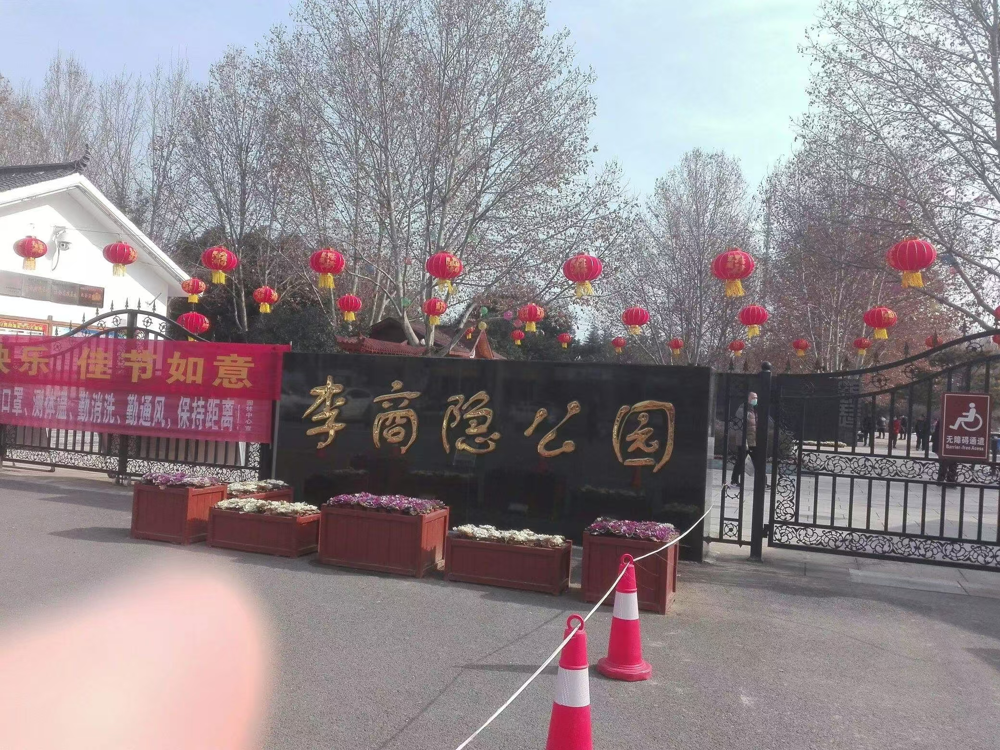
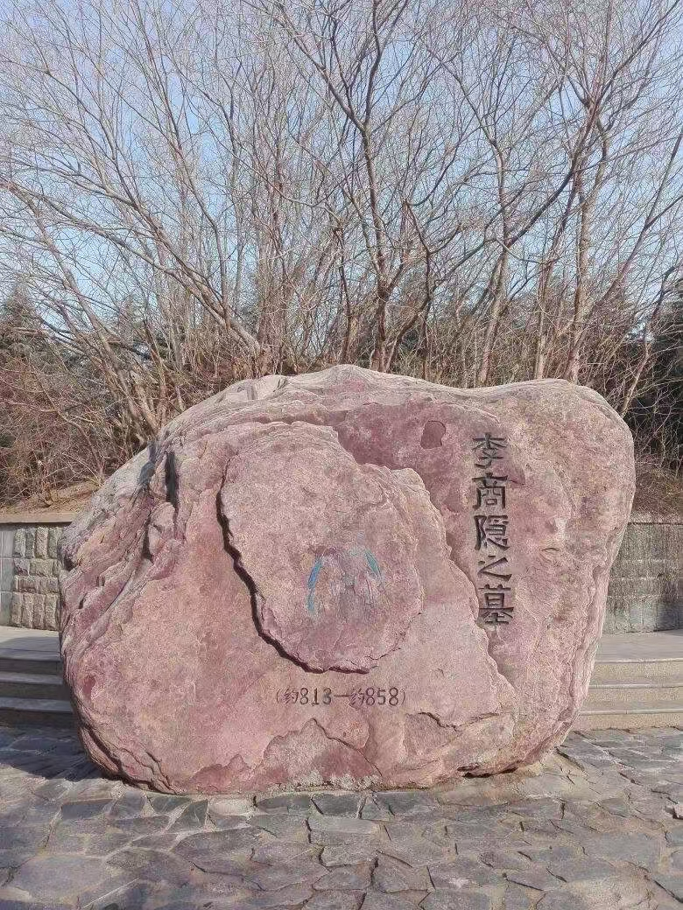
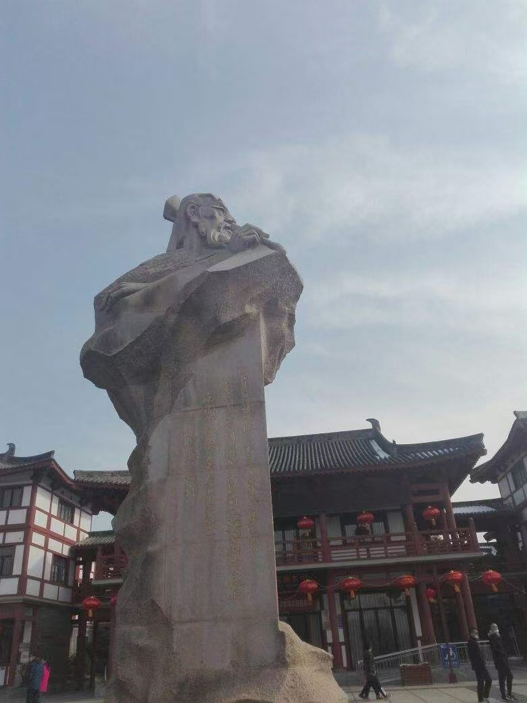
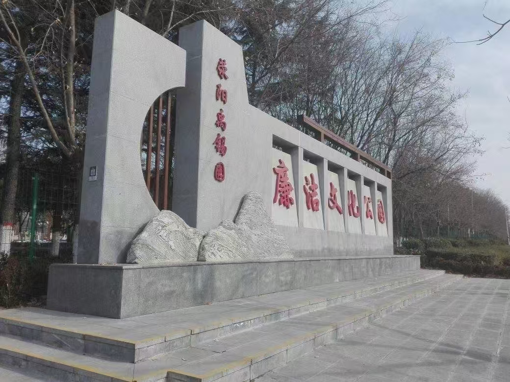
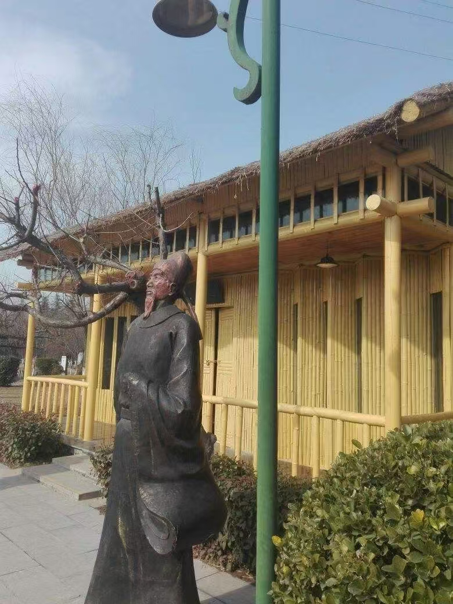
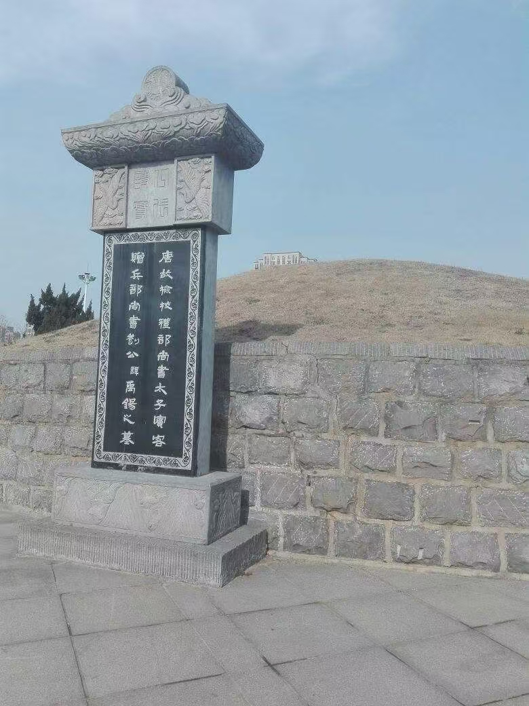

# 在两位古人的墓前

早就知道荥阳是两位古人的长眠之地。放假后，时间宽绰了不少，便抽一个上午前往访古。

说实话也不算访古了，两位古人的墓园现在已经名为“公园”，成了当地人休闲散步的去处。

你道这二位是谁？两人都是唐代诗人，一个是李商隐，一个是刘禹锡。二人的墓园相距不远，其路程驱车大约10分钟。

闲话少叙，这就到了李商隐公园的门口。迎面是座雕像，诗人低头抚琴，右侧是“锦瑟”二字，左侧是《锦瑟》全诗。绕过雕像，后面是个小广场，小孩子们在那儿奔跑说笑。

公园的小径呈半环状，从右边算起，李商隐墓的位置大约在120度的位置。小径两旁倒有些人工造景，兼有与之相配的李商隐诗，这里修公园的人算是动了点功夫。

李商隐墓四面环着小围墙，苍松翠柏植于墓两侧。小围墙上有些石碑，上刻李诗，重复最多的是《无题》，“相见时难别亦难”那首。前几日下的雪还未化，一堆一堆在土上卧着。坟冢上尽是枯树，缠绕纠结，枝枝丫丫指向天空，像扭曲的手掌。李商隐本人陷于晚唐牛李党争，一生抑郁不得志，这树不知是有心还是无意，成了他一生的写照。

墓冢后头有座碑，现代人写的。碑上记述李商隐的一生，怎么看怎么像是史书上传记的翻译兼引用。语体半文半白，格外奇怪。这碑也不是常见的那种石碑，而是一大块黄色的石头，凹凸不平。有的字正好凿在石头的凹处，漫灭不清。

再往后边走，就又是几座雕塑，看上去颇有后现代的味道。有一座看了好久才知是蜡烛，底下照例是《无题》（相见时难别亦难）。在这儿，你走上一遭就知道诗人的哪首诗最有名了。另一座名曰“青鸟”，鸟却是黄的。我看的书少，不知道到底对不对。

离谱的是“李杜廊”。所谓“李杜”，是李商隐和杜牧。然而廊下刻诗，均为李商隐所写。杜牧若是地下有知，不知作何感想。

从李商隐公园出来，便寻道去刘禹锡公园。两个公园附近都是仿古建筑，雪落在上面，还未化。这一带都属于古时的檀山（也有写作坛山的），而今已成了闹市。

猛地眼界一阔，心胸也为之一振。

刘禹锡公园恰卡在V字形路的空隙处，附近并无高楼，加之地势稍高，目及之处一片空阔。迎面是座牌坊，上书“诗豪”。牌坊两侧有数副对联，最有名的是“沉舟侧畔千帆过，病树前头万木春”。过了牌坊，是刘禹锡的巨大雕像，诗人做愤而执笔状，英气逼人。雕塑上亦刻有《酬乐天扬州初逢席上见赠》，字迹有放荡不羁之势。

这雕塑和牌坊都是在V字形路空隙的广场上的，广场和真正的公园以一条小道相连。广场一侧，响着“欢迎来到刘禹锡公园，请佩戴口罩，进行扫码登记”的机械女声，另一侧是个仿古的小厕所，门口立着块LED屏，不停地播着就地过年的宣传片：“今年春节，我在郑州挺好的。”

进了公园，便是一片大湖。有鸭子在游，小橘掌轻快地拨着水。呵！春江水暖鸭先知。甫一想到这句，便听后面有个声音也正念着“春江水暖鸭先知”呢！转过头去，隔着口罩会心一笑。

值得提及的是，刘禹锡公园并非仅仅是刘禹锡的墓园，更是国家廉政教育基地。因此，路边石刻中不只有刘禹锡的诗文，更有历朝历代有关廉洁的诗文。这些石刻又颇具艺术感，字体龙飞凤舞，若非背过，实难窥探诗歌的真貌。本来还秉着遇诗拍照回去查找出处的原则，到这只好作罢。不过还是认出了几首，有李商隐的“历览前贤国与家，成由勤俭败由奢”，还有郑板桥的两首诗。来往游人，大多无视这些龙飞凤舞的“经典”“教育”“艺术”，任它们留在草丛中。这里的诗实在应当以正楷书写，再清清楚楚地写上作者朝代，不然又怎么达到“廉洁教育”的效果？

一路上有不少人造景，皆处在建成与未建成的叠加态中。“沉舟侧畔千帆过”景观，以绿色预制板搭成，形似船帆，又不敢确定，或者是还没有建好临时堆放的？“陋室”也在公园里现了形，刷的通体黄色，煞是耀眼。陋室门未开，不过陋室“往来无白丁”，我辈白丁当然是无从进入了。便从玻璃处做窥视状。室内无他物，唯有一油漆桶孤零零立着，可谓陋矣。陋室门前亦有一诗人雕塑，诗人作举目深思状。看罢雕塑，鄙人心下暗忖：陋室铭应在此附近！屡寻无果。后于公园某处草科里寻得一碑，孰视之，乃见篆字《陋室铭》。该碑与陋室距离，约与公园直径等同。

可能是因为疫情，也可能是因为时间没赶上（当时都12点多了），刘禹锡公园内的展览馆并不对游客开放。遂循山路至刘禹锡墓。

刘禹锡墓可比李商隐墓气派多了。冢上平平整整，唯有枯草，没有枝枝丫丫的枯树。墓在山上，并无围墙，举目一望，天高地阔。刘禹锡生时诗风豪迈，有“诗豪”之称，竟与其墓地景况暗合。

墓前有碑，上书一长串官职。墓后有现代人所立碑，上书“刘禹锡，唐代哲学家，文学家……”，仔细一看，撰文者与撰写李商隐碑文的为同一人。这碑与李商隐的碑不同，石面光滑平整，看着舒服多了。墓旁有柱，上书刘禹锡诗文，颇有意趣。

从墓后下山，又有一处人造景观，名为“十二牌坊”。依刘禹锡生平所至之地而立，每坊皆有两幅对联，述其身世。游走其中，不觉便走完了诗人的一生，有一股子奇异的感觉。这感觉就像你在做卷子上的文言文阅读一样：第一行那人还是个翩翩少年，再过几行就变成了踌躇满志的新官，下面几行不免是宦海沉浮，再下去便垂垂老矣，一命呜呼了。在后人看来，人的一生是多么的迅速、短暂，甚至乏善可陈，几句话就说完了；但对于那个正在经历自己一生的人来说，这是独一份的经历，能且只能经历一次。

感慨过后不要忘了这里仍是廉政教育基地。十二牌坊中间还插入了古代官员“举报箱”的历史。先是“诽谤之木”，后来变成“表木”，最后居然变成了现代的“举报箱”。铁皮箱子放在一堆古色古香的东西里面，实在突兀。

说来奇怪，我游记中所发的感慨，大多不是旅行之中得到的。很多时候感慨是在写游记的过程中涌现出来的。兴许在我离开景点的时候旅行还未结束，只有当我写完游记，一切真正尘埃落定，旅行才真正结束吧。

在当时，旅行的时候，我并没有什么机会同时站在两位古人的墓前。物理距离阻止我这么做。但当我离开两个公园，两位古人的墓冢已同时存在于记忆里时，我便可以同时站在他们的墓前了。一个墓荒凉，另一个墓开阔；一个墓草木深深，另一个墓并无草木阴翳。与我同游的人总觉得这样的构造对李商隐墓有点不公平，毕竟刘禹锡墓整饬一新而李商隐墓看上去无人打理。但我却想到，这样的设计恰与李商隐委婉含蓄、刘禹锡开阔豪迈的诗风相合。或者，人们“偏袒”刘禹锡墓的原因是他是个唯物主义者（标牌上是这么介绍的），敢于反抗权威，而李商隐总是写些无题的爱情诗，是靡靡之音不宜于弘扬主流价值观？我说不清。但墓园大或小实际并不重要。站在两位古人的墓前，真正席卷我的是一种强烈的孤独感。这孤独感与时代无关，与身份地位统统无关——只要一个人如今还活着而将来要死去，大概在某个时刻就会有这样的感受。

看吧，人们为他们修筑起了大墓，把他们的文字刻在石碑上。人们为他们塑起雕像，在他们真实的躯体上敷一层一层的油彩。有的人成为“圣人”。有的人成为“偶像”。有的人成为“反抗者”。有的人成为“英雄”。看吧，这就是历史做出的勾当！它只筛出那些自己想说的事情，流诸后人。后人于是知道了：这就是“圣人”！这就是“偶像”！这就是“反抗者”！这就是“英雄”！而他们自己究竟是什么？除了他们自己根本没人知道，也没人在乎！当然没人在乎。人们只在意自己所认为的别人是什么，而不在意别人究竟是什么。所有的给别人脸上贴的金实际上都是在给自己心里面的那个信念贴金。在这个意义上，所有的人都是彻彻底底的利己主义者。

我注视着他们的墓碑，注视着那些名讳，官职与后人所发的感慨。我想到我去的另一些墓园，那些埋葬着普通人的墓园。我想到那些墓碑上写的文字：不管生前怎样，都是些溢美之词。我想到历史里的循吏与酷吏们，那些后人评说的东西，事实是怎样的？他们自己认同那些判断吗？难道几行文字足以写尽一个人复杂的一生吗？

嘿，为了什么呢？如果终要被曲解，终要成为追悼词上的溢美之词和批判之语，终要成为墓碑上的寥寥数语——那么，不如不要在历史上留下姓名，不如就像那些在乱世里苟活的人一样，过完寂寂无名的一生，死去。

我忽而觉得他们的墓无人问津是件好事了。我原来去过孔林。孔子的大墓，更气派。松林森森，后人祭拜者络绎不绝。他的墓碑上有了“至圣先师文宣王”的字样，鎏了金，上面还有几道裂纹：是十年浩劫时被打碎后重新拼合留下的印记。后代给他加了太多的荣誉，那个时而忧郁时而快乐时而愤怒的立体的人几乎成了神；文人们来拜谒，觉得自己也变得更有文化了一点；也有要高考的家长学生来，烧了高香，虔诚跪拜，求一个好前程。我好像记得论语里面说子不语怪力乱神来着。又有谁是读完了《论语》，敢说自己充分了解了孔子后才去的呢？

这个时候我顿感惭愧。站在这几位的墓前，我也只是知道他们文章诗集中的寥寥几句，未曾知道他们人格的全貌，只好通过二手的评价认识他们，莽撞地发些无用的感慨。

呜呼呜呼，知音少，弦断有谁听？

我在他们的墓前面——以及之前和之后更多人的墓前面想到了这些，然后就离开了。我看见一座公园的门口诗人抚着琴，若有所思。另一座公园门前诗人昂着首，望向白色的充满阴云的天空。诗人们的真实面容已消逝在历史中，这两尊雕像上的面容大概也是后人想象而成。他们是否成了他们活着时希望成的人？或者他们本来就是后代们所描绘的那个样子？我不知道，也不可能知道。