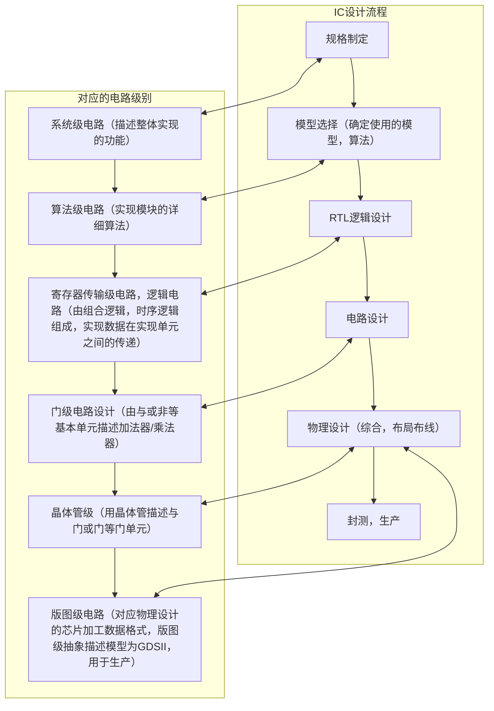

- MOSFET
	- 1960发明:比三极管体积小，能效低，开关更快
	- 1965 CMOS：与双极相比，待机功率大幅度降低
	- NMOS：栅极高电平导通，源端接地
	- PMOS：栅极低电平导通，源端接Vdd
- 工艺节点：（多少纳米）
	- 传统命名：栅极长度和金属半节距（芯片内部金属线间距离的一半）
	- 20世纪90年代之前技术节点大致与其命名一致
	- 但随着制程和工艺的精进，工艺节点已经与实际的物理特征脱节
	- 当前的技术节点指采用特定技术制造的特定一代芯片
- 分类
	- CPU执行从内存中调取命令和运算数据进行运算并写回内存的命令
	- GPU加速图形图像的处理，拥有浮点运算能力强，并行运算强的优势
		- 异构协同处理计算模型中将CPU和GPU结合起来
		- GPGPU：用处理图形任务的图形处理器计算原本由中央处理器处理的通用计算任务
	- CPU：高性能的大核，高性能的同时足够复杂/GPU：高效能的小核，每个核的性能较低，但小核并行起来的性能足够高，灵活度较高，功耗低，与专用ASIC相比，性能较低，缺乏对特定应用的硬件优化。
	- TPU张量处理单元：神经网络训练的处理器，用于神经网络算法处理中的矩阵卷积的运算，功耗低，能效比很高
	- ASIC：Application Specific Integrated Circuit，针对某个应用的特定的集成电路，可以将许多芯片的工作整合到一个更小更快的封装中，降低制造和支持成本，提高内置芯片的速度
		- 针对特定功能
		- 设计周期长，难度大，芯片效率高，功耗低，固定成本高，变动成本低
	- FPGA：Field Programmable Gate Array 现场可编程门阵列，包含门矩阵的集成电路，半定制电路，数字电路没有ASIC速度快，灵活度高，并行性能高，大量使用成本较高。
	- SoC:System on Chip，片上系统，相对ASIC更通用的功能，通过IP核的调用把实现不同功能的终端集成在了一个芯片上
		- 包括：控制处理单元，存储器控制器，内存不够时还有存储器单元，专用数据处理模块，总线控制器，I/O接口，调试接口，时钟，中断控制逻辑单元
- 算力：计算能力，对信息数据进行处理的能力，芯片成为了算力的主要载体
- 人工智能的三大核心要素：算力，算法和数据
- 衡量算力的单位：OPS/FLOPS
## IC设计流程
高性能，低功耗，小面积（高集成度），低成本，短周期

模拟电路设计流程：
数字电路设计（逻辑综合由专业的电子设计自动化（EDA）工具支持）
#### 基本概念
- RTL：寄存器传输级，电路设计的一个层次，在这个层次上，通过时钟实现数据在时序单元之间的传递
	- 使用硬件描述语言（HDL，如Verilog编写）
	- 描述了电路的功能，用于模块化设计的 RTL 代码是可综合（可生成网表文件的）
- 逻辑仿真：以事件驱动为基本形式，验证设计代码在逻辑功能上的正确性，优点为：灵活，易于调试，透明，快速
	- TestBench：针对需要验证的RTL，编写输入激励，并验证代码是否复合预期逻辑功能（行为级仿真）
- 逻辑综合：由RTL电路转换至门级电路，生成门级网表文件。其中包括翻译（将HDL转变为布尔代数），优化（优化面积，速度，功耗），映射（采用相应工艺库，映射实际逻辑电路）
	- 标准单元：数字电路设计的基本单元，由厂家提供，用于仿真，综合，静态时序分析，布局布线，功耗分析，一致性检查等
	- 静态时序分析：在不需要输入的情况下，分析所有路径的时序属性，得到最差情况，速度较快。（最长路径不一定会影响功能，可能是非逻辑功能经过的路线）
	- 时序路径：起始点：设计电路输入端/触发器时钟端；终止点：设计电路输出端/触发器数据输入端
	- 建立时间：时钟沿到来前数据从不稳定到稳定所需时间
		- 时钟周期 $Tc\geq t_{pcq}+t_{pd}+t_{setup}$ ， $t_{pcq}$是触发器的*最大*传播延时，$t_{pd}$ 是逻辑电路*最大*传播延时。
		- 不满足要求的解法：减小 $t_{pd}$ ，或通过流水线分解延迟，或增加 $T$ 
	- 保持时间：数据稳定后需要的保持时间，不满足要求数据将不能被稳定读入
		- $t_{ccq}$ 触发器的*最小*传播延时，$t_{cd}$ 为逻辑*最小*延时，$t_{hold}$ 为保持时间，$t_{hold}\leq t_{cd}+t_{ccq}$ 
		- 不满足要求的解法：插入延迟模块，且考虑 $clk$ 到不同触发器引脚的延时差 $skew$ 
- 形式验证：使用纯数学方法分析逻辑是否完全等价（不需要输入），保证综合过程/后端电路/手动修改前后RTL没有引入逻辑错误，是电路设计中常用的等价性检查
- 可测性设计（Design for Test）：在芯片设计阶段，加入扫描链的可测试结构，增加电路内部节点的可控性和可观测性，方便检测出因为制造缺陷，芯片生产不合格导致的坏品，主要用在晶圆测试，封装后终测中
- 布局布线：主要涉及到每个模块中标准单元的位置，以及标准单元之间的连接，目的是高性能，低功耗，小面积
	- 由EDA工具支持
	- 步骤：导入网表文件→布局规划→布置标准单元→时钟树综合→布线
	- 布局规划：利用软件代码布置标准单元，电源管脚，I/O管脚
	- 布置标准单元：EDA工具根据预设的面积利用率自动进行标准单元的放置
	- 时钟树综合：平衡时钟路径的延迟，对同步数字系统的功能，性能和稳定性起决定性作用
	- 布线：器件之间的连线，可以通过EDA工具完成
- 物理验证
	- DRC：设计规则检查，检查布局布线中各个尺寸是否满足要求，在布局布线之后，生产之前进行
	- ERC：电器规则检查：检查电路短路，开路，浮置等情况，在布局布线过程中进行
	- LVS：检查物理布局后的电路和输入网表的功能是否一致，在布局布线之后进行
		- 由CAD工具实现
- 寄生参数提取：进行布局布线，版图设计之后，根据工艺特点和参数，提取出包含寄生电阻电容的网表文件，转换为标准延时格式，用于后仿真
	- 后仿真：也叫门级仿真，时序仿真，带反标的仿真，需要利用布局布线后获得的精确延迟参数和网表进行仿真，验证网表的功能和时序是否正确
- 版图：由一系列重叠起来的多层几何图形组成，代表具体的物理设计，格式为GDSII，包含详细版图信息，可以用于掩模版的制作

## FPGA
- 二维逻辑阵列，包含可配置逻辑块，I/O块，连线和其他辅助单元
	- 可配置逻辑块：FPGA核心功能单元，包含一系列查找表，多选器，触发器等
	- I/O块：作为FPGA和其他模块通信的接口，连接I/O外设和逻辑块，连接I/O引脚和颞部布线要素的模块IOB，同交换矩阵相连
	- 互连线：进行逻辑块，I/O块内部和之间的连接
- 可配置逻辑块：CLB是FPGA的基础功能单元，用于实现组合逻辑和时序逻辑，每个可切分为2或4个Slice，包括查找表，触发器，多选器等，为块状，便于连线
	- 查找表：用于实现逻辑真值表，主流FPGA基于SRAM存储单元实现
		- n输入，获得 $2^n$ 个结果
	- MUX：多个输入信号中选择单个输出信号，使用MUX选择真值表的输出
	- 不同CLB之间以及CLB和I/O之间通过FPGA的布线资源相连，其中通过交换矩阵块改变连线的方式，从而实现不同的连接方式

设计流程：工艺映射（门级网表转化为查找表）→逻辑打包（独立的查找表打包到逻辑块）→布局（决定逻辑块在FPGA上的位置）→布线（决定逻辑块的连线通路）
## 逻辑设计
- 锁存器与触发器
	- 锁存器是电平触发，触发器是边沿触发
	- 锁存器面积小，锁存器更快，锁存器功耗小，但会受到尖端毛刺的影响
