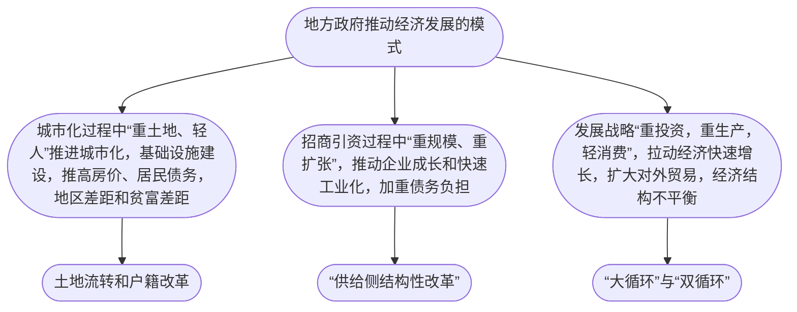
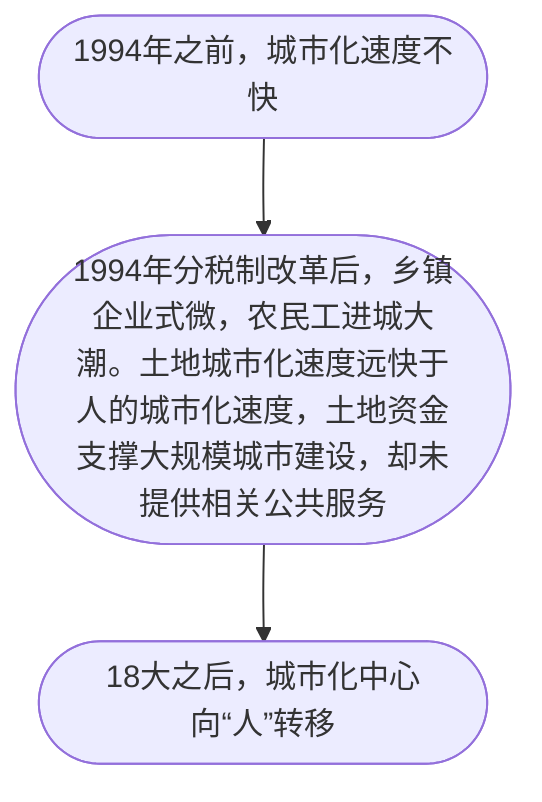

> 当下最重要的问题不是我国的GDP总量哪年能超过美国，而是探讨我国是否具备了下一步发展的基础和条件：产业升级和科技进步还能继续齐头并进吗？还有几亿的农民能继续城市（镇）化吗？贫富差距能控制在社会可承受的范围内吗？在现有的基础上，下一步改革的重点和具体政策是什么？……有经济史学家在研究美国崛起的过程时曾言：“在成功的经济体中，经济政策一定是务实的，不是意识形态化的。是具体的，不是抽象的。”
# 前言
- 在我国，不可能脱离政府谈经济
- 以地方政府投融资为主线
# 微观机制
## 地方政府的权力与事务
- 权力和资源在政府体系中的分布规则
	- 纵向
	- 横向
### 政府治理的特点
- 管理体系：中央-省-市-县区-乡镇
- 体质特点
	- 中央-地方：“中央统一领导下，充分发挥地方的主动性、积极性的原则”
	- 党-政府：无需区别，经济上组织、人员高度重叠
	- 条块分割，多重领导
		- 原因：中央的政治架构，省市县三级完全复制（“四套班子”）
		- 垂直关系：地方-中央
		- 横向关系：以行政区划为界
		- 县教育局既受市教育局领导，又服从县委县政府
	- 上级领导与协调
		- 跨部门/跨地区事务常常向上集中
		- 制度设计：避免把过多决策推给上级，在达成共识的最低层级解决问题
		- 设置“分管领导”“领导小组”
	- 官僚体系（从古到今，三大特点，央地关系平衡的体现）
		- 官员学习和贯彻统一的意识形态
		- 由上级任免
		- 需要在多地轮换任职
### 事权划分三大原则
处理不同群体的利益差别与冲突：不同（区域）的人对公共服务的看法；掌握不同信息的人；上下级的目标
#### 外部性与规模经济
- 外部性：主体的行为对其他主体有影响。可以从外部性的角度理解地方经济。
##### 什么决定了地方资源/政策的影响范围？
- 公共物品和服务的边界：公共物品用的人越多越划算，但人多了质量会下降，所以公共服务具有边界（《联邦党人文集》讨论了规模经济的好处）
- 人口密度、地理与文化差异
	- “撤县建区”与“xxx一体化”
	- “随山川形变”vs“犬牙交错”
	- 文化的聚合、文化区域被行政区划割裂
例子：行政交界地区的经济发展（利用以上几个因素分析其经济不发达的原因）：革命时期的“xxx边区”、道路网络中的“边界效应”（省界地区路网密度较低）、环境污染、地方保护主义与市场分割
##### 针对上述现象的解决方案
- 跨区域的共同上级
- 区域性整合（扩张县/撤县设区）
#### 复杂信息
行之有效的管理要求掌握关键信息。具有信息优势的一方有决策优势。
- 信息与权力：
	- 上级有最终决定权“形式权威”
	- 下级却掌控了信息（专业优势/经验）“实际权威”
- 信息获取与隐瞒：
	- 文件和会议：权力的载体，催生了复杂的文件会议制度
	- 上下级/部门之间的事权内部依赖规章制度，即各类文件（参看2012国务院《党政机关公文处理工作条例》）
	- 关键信息可能被利益相关方隐瞒
	- 为获取信息，上级常常进行监督和审计，而监督机制本身也常常受到制约（“驻地效应”、水污染治理中的信息扭曲）
	- 信息复杂多变，因此体制内的实际权力和责任都高度个人化（权力就是在说不清楚的情况下由谁来拍板决策的问题），形成了“一把手负责制”，规章制度无法完全取代个人信任。
#### 激励相容
激励相容：参与事情的两方均有意愿/能力做好。政府要求上下级间，工作目标和官员利益之间激励相容。
- 上级政府想做的事情
	- 具体，规则和流程相对明确，专业性强，标准化程度高的部门，主要垂直管理，绩效由上级评价
	- 工作性质较为专业，但与地方经济密不可分，需要本地配合
		- 双重领导的部门面临激励机制设计问题，市场改革之后，利益不仅扩大，而且多元化了，意识形态教化已经不是完善的激励机制，故应使决定工作内容/可以评价、奖惩工作业绩的上级为同一上级。
	- 抽象宽泛，需要下级发挥主动性和创造性调动资源达成
		- 解决方案：放权地方，地方负责，地方分享发展成果，效果和代价匹配。
		- 明确地方的权利和责任，“属地管理”
		- 权力和资源的配置要制度化
		- 用来自外部的竞争约束地方政府

### 招商引资
地方政府的权力对经济发展的深刻影响在“招商引资”过程中体现，涉及土地开发、金融支持、协助落地、补贴和税收政策、创造就业等，体现了“混合经济”体系。
## 财税与政府行为
事权与财力匹配是一个原则；事权与财权匹配则不一定。
从财税的视角理解地方政府行为。
### 分税制改革
#### 1985-1993，“事权与财权匹配”“财政包干”
1980年之后，中央和省级财政之间对收入和支出进行包干，地方流出一部分增收。
- “收入递增包干”，设定固定的年收入增长率，超过的上交中央，其余与中央五五分成。
- 确定一个初始金额和递增数，剩下的归自己
- “定额上解”
造成的结果：
- 兴办乡镇企业，政府收得增值税，并且收取企业上缴的利润。
- 中央财政预算收入占全国财政预算总收入降低；全国财政预算总收入占GDP的比重也降低，削弱了国家的财政能力
	- 前者：地方财政收入增长更快
	- 后者：承包制本身不稳定，地方政府为了拿到更多钱有意不让预算收入增加，且当时盛行预算外收入，所以地方常常“藏富于企业”，通过其他手段收回。
#### 分税制改革与央地博弈
1994分税制改革：
- 税收分为：中央税、地方税、共享税。
- 国税、地税两套系统，与地方财政部门脱钩，省以下以垂直管理为主
- 税务系统人员激增，税收征管成本和纳税成本均增高
- 重要税种：增值税，由地方税变成共享税，中央：地方分成3:1，防止地方收入急剧下跌设立“税收返还”机制。
成功的政策背后是成功的协商和妥协，而不是机械的命令与执行，所以理解利益冲突，理解协调和解决机制，是理解政策的基础。
税收改革时的“基年”往往出现收税尖峰，因为地方为了抬高税收基数，增加返还的税款，常常出现突击收税等现象。
### 土地财政
分税制减少了地方手头可支配的财政资源。地方希望取得更多资金，除了增加税收规模外，围绕土地出让和开发，产生了“土地财政”。
#### 招商引资与税收
分税制改革后，企业的税收在所在地上缴，刺激地方政府招商引资。地方政府青睐重资产的制造业。由于税收征收自企业，且在生产环节征收，地方政府重视企业而轻视民生，重视生产而轻视消费。
2002年，科学发展观提出更加重视民生支出。
分税制改革后，地方政府手中用来发展经济的资源受到挤压：
- 预算内财政支出转向公共服务和民生
- 改革后，企业向地方政府缴纳的预算外收入减少
- 乡镇企业改制，利润不再上缴
- 2001年税改，中央拿走所得税收入的60%
#### 土地财政
- 土地公有制，城市土地归国家所有，农村归集体所有。农地转为建设用地，首先要征地变成国有土地，之后才可以用于发展工商业或建造住宅。
- 1994年分税制改革，国有土地转让的决定权和收益都留给了地方。此时国有土地转让收益很少，为了招商引资，土地转让价格也很低。
- 1998年，单位停止福利分房，实行住房分配货币化，《中华人民共和国土地管理法》实施，确立城市政府对土地建设的垄断权利。
- 1999-2000年，土地转让过程不透明，开发商趁改革时期的一些政策进行房地产开发，转手就可以发家致富。
- 2001，实现经营用地“招拍挂”制度。各地政府开始征收农民土地然后有偿转让，土地财政开始膨胀，土地出让收入激增。
- 21世纪初，地方获得大规模的土地财政收入，低价供应大量工业用地招商引资，同时限制商住用地供给，从攀升地价中赚取土地垄断收入。
土地财政是指，巨额的土地使用权转让收入，也包括对土地使用和开发的各种税收收入，随着土地升值，房地产开发和建筑企业的发展而猛增。
土地财政的实质是房地产财政。
### 税收、收租与地方政府竞争
- 经济发展无非是提高资源使用效率——两项主要资源：人力和土地。过去几十年的很多重大改革，大多都和盘活这两项资源有关。
- 地方政府压低工业用地价格，因为工业对地方经济发展有诸多好处，且工业企业落地的地方较多，具有一定的市场竞争性。而商住用地则强调土地供应方的垄断力量，容易抬高地价。
- 土地的资本化运作本质是把未来的收益抵押到今天去借钱。投资质量高，则不会有债务问题，然而地方官员任期有限，可能出现“面子工程”，投资质量下降，收益不高。
- 全国范围内，土地资源和建设用地分配很难优化。用地指标无法跨省流动，资源无法转移到效率更高的地方，无法长久地提高整体效率。经济发展阶段变化之后，工业市场竞争激烈，很多地方不具备这些条件，建设用地指标无用。
### 纵向不平衡与横向不平衡
纵向不平衡：中央和地方的不平衡；横向不平衡：不同地域的不平衡
#### 基层财政困难
- “财权层层上收，事权层层下压”
- 东部：从“土地财政”中获取大量额外收入；西部：“讨饭财政”，乱收费以保持正常运转，拖欠工资etc，引起“三农问题”
- 2000，农村税费改革；2006，农业税彻底废止（原因，加入WTO后工商业发展，国家财政不再依赖于农业税费），但基层财政维持更困难了。
- 中央和地方共同负担国家公共财政保障范围；奖励精简机构和人员的县乡政府（分税制之后，转移支付与在编人员成正比，刺激了地方政府扩编）；“乡财县管”-“扩权强县”（提高县里的权限）、“财政省直管县”（县财政和省财政发生关系，在财政收支权力上做到县市平级）
- 使得一些地区经济发展，但也使一些地区出现腐败乱想，难以产生规模和集聚效应。仍然存在诸多问题。
#### 地区间不平等
- 公共财政的功能：再分配财政资源。中央对中西部地区大规模转移支付。
- 然而，受纵向差距的影响，省级的差距到了基层，就被层层放大了。
- 中央对地方的转移支付
	- 一般性（均衡性）转移支付，地方可以自行决定用途
	- 专项转移支付，专款专用。
		- “做项目”，然而有可能加大地区间的不平等
			- 上级倾向于“突出重点、择优支持”
			- 项目要求地方政府提供配套资金
			- 人情关系在所难免，经济发达地区往往与中央部委的关系更好
	- 为何分类：无条件的转移支付，越穷的地方的钱越多，缺乏增收动力，可能会恶化冗员问题
## 政府投融资与债务
土地本身不值钱，值钱的是土地之上的经济活动。当“土地财政”嫁接了资本市场，就成了“土地金融”。土地不会移动也不会消失，天然适合做抵押，做各种资本交易的压舱石，身价自然飙升。资本化的土地挣脱了物理属性，将储蓄、收入以及对未来的愿景统统封存，支撑起了工业化和城市化的投资。
经济发展的奥秘之一，正是把有形资产转变成为抽象资本，从而聚合跨越空间和时间的资源。
政府债务问题更远不在收入不够，而在支出太多，扮演的角色太多，需要改变政府角色。
借债投资形成的资产良莠不齐。
### 城投公司与土地金融
- 地产开发属于实业投资，开发难度大。
- 实业投资是个连续的过程，具有多个阶段，需要不断投入，也涉及到多个主体的专业和事务，需要多个主体投资和运作。
- 政府拥有城市土地，掌握着金融系统，以各种方式介入实业投资。
- 投资过程往往不可逆，政府常常对投资深入干预。
### 地方政府融资平台
- 法律规定，地方政府不能从银行贷款，想要投资，需要成立专门的公司，即一些国有独资企业，称为“地方政府融资平台”，大多有“建设投资”“投资开发”字样，被统称为“城投公司”，也有一部分开发旅游景点的公司，名称中一般有“旅游发展”字样
- 简单的政府-市场二元观没什么用
- 特征：
	- 持有从政府取得的大量土地使用权
	- 盈利状况依赖政府补贴
	- 投资的项目带有基础设施属性，在计算回报时，考虑带动的经济效益和社会效益。
	- 政府的隐性担保可以让企业大量借款（政府会向融资平台注入各类资产，时常会认为这些公司不会破产，风险很低）
- 划出来的“生地”，经平整清理后成为向市场供应的“熟地”，称为“土地一级开发”，投入大，利润低，涉及拆迁，常常由政府融资平台公司完成，之后的建设运营称为“二级开发”，大多由房地产公司来做。
#### 工业园区开发
- 大多数融资平台的主业是工业园区和城市基础设施建设
##### 苏州工业园区为代表的东部工业园区开发：融资平台主要负责土地一级开发
- 政府将土地以资本形式注入融资平台，开发后由政府回购，在土地市场上出让，卖给房地产企业进一步开发
- 融资平台可以用政府注入的土地抵押贷款，用未来土地出让的受益权质押贷款，也可发债，还款就是管委会回购土地时支付的转让费及补贴。
- 是否成功取决于地区经济发展水平和营商环境
##### 华夏幸福为代表的中西部工业园区开发：一二级并进，“产城结合”
- 民企，既负责拆迁和平整，也负责二级开发。按照流程，政府仅仅委托该企业做一级开发，但实际操作中，其他企业往往很难参与产业园区中的房地产项目。
- 政府划一大片地给企业，既有工业用地，也有商住用地
- 赚钱主要靠开发房地产，“产”是旗帜，“城”是重点，用卖房赚到的快钱支持城市运营，用房地产的盈利反哺产业园区。
- 企业可以同政府分享税收收益。
- 类似于海外“政府和社会资本合作”，特色
	- 项目多，规模大
	- 社会资本大多不是民营企业，而是融资平台公司或其他国企
### 地方政府债务

可以看出，只要投资和建设可以带来持续的经济增长，低价就会上涨，就可以偿还越来越多的债务；而经济增速一旦放缓，低价下跌，土地出让收入减少，累积的债务就成为沉重的负担。
地方债的爆发：2008-2009年，为缓解，中央放宽对地方融资平台和银行信贷的限制，同时投资“4万亿”。县一级政府融资平台剧增，然而却泥沙俱下，地方政府积累了很多债务。
#### 为政府开发投资：国家开发银行与城投债
- 分税制改革后，地方财力吃紧而城市化加速，若要大规模城建，则需要在开发中引入银行资金。
	- 需要可以借款的公司
	- 开发项目繁复，需要将盈亏不定的项目捆绑在一起
	- 仅靠财政预算不够还债，要把土地相关收益用起来
- 1998年，国家开发银行（世界上最大的开发性银行）&安徽芜湖合作，诞生了城投公司芜湖建投，借款10.8亿元。市财政用预算安排的偿还资金做还债来源
- 2002年，土地“招拍挂”推行，土地出让收益作为质押成为还款保证
- 2003年，允许以土地增值收益作为贷款还款来源。
- 2008年，“4万亿”财政金融刺激之后，各种商业银行才开始贷款给城投公司。其中城商行与国开行、四大行平起平坐
- 商业银行中包括城商行。城商行主要由政府控制。地方政府往往掌握至少一家银行，方便为融资平台公司和基础设施建设提供贷款。
- 存在风险
	- 基础设施建设项目周期长，需要中长期贷款。国开行是政策性银行，适合提供。但商业银行资金多来自短期存款，与贷款期限不匹配
	- 四大行存款来源庞大稳定，可以承受一定程度的期限错配，而城商行的存款来源并不稳定。
- 城投公司的融资方式
	- 银行贷款
	- 发行城投债
		- 理论上的好处
			- 分散风险
			- 可以交易，将不同风险的债券分配给不同类型的投资者，提高配置效率
		- 实际
			- 城投债七八成倍商业银行持有，流动性差
			- 市场认为城投债有政府隐性担保，很安全
#### 地方债务与风险
- 地方债务的麻烦在于“隐性负债”，融资平台公司的负债占大头。
- 层级越低的正负负担越重
- 中西部的债务负担和风险远高于东部
- 地方政府投资的项目主要有外溢的经济效益和社会效益，但投资回报率低，收入也低。大多数省份的融资平台公司的平均收入都无法覆盖债务利息支出
- 经济遇冷，低价下跌，政府也难以背起债务
#### 地方债的治理与改革
- 债务置换，用地方政府发行的利率低的公债替换融资平台公司利率高的银行贷款和城投债
	- 减少利息支出
	- 政府公债期限长，为项目建设注入长期资金，降低期限错配和流动性风险
	- 政府比融资平台信用更高
- 厘清融资平台和政府之间的关系，破除政府对其形成的“隐性担保”
- 约束银行各类金融机构，避免大量资金流入融资平台
- 问责官员，对过度负债的行为终身追责
### 招商引资的地方官员
聚焦地方官员在招商引资中的作用
#### 官员政绩与激励机制
- 激励机制
	- 自身的升迁取决于本地的经济发展
	- 党纪国法的惩罚体系；不同地域招商引资的激烈竞争
- 地方主官为提升经济增长，会
	- 加大投资力度，上马大工程，大项目
	- 上任之初基础设施投资、工业投资、财政支出往往上涨
	- 上任之初土地出让数量一般增加，新增土地供应大多位于城市周边郊区，呈现“摊大饼”的态势
- 我国每年有三成左右地级市更换市长/市委书记，“政治-投资周期”频繁。
- 呈现“偏重投资的增长模式”，产生了许多不良后果
- 普通公务员大多关注实际收入和工作福利而非竞争，这些与本地经济发展和地区财政紧密相关
- 强调内心驱动和自我约束的重要性
#### 腐败与反腐败
- 我国腐败现象的特点
	- 腐败与经济高速增长长期并存
	- 腐败形式随政府/市场关系变化
- 不同类型的腐败
	- “掠夺式”
	- “官商勾连共同发财式”，发生在招商引资过程中
		- 短期经济增长
		- 带来恶果
			- 经济结构扭曲，资本收入占比高，劳动收入占比低
			- 扭曲投资和信贷资源配置，大量资金浪费在关系户项目上
			- 权钱交易扩大贫富差距
			- 地方形成利益集团
## 工业化中的政府角色
### 京东方与政府投资
- 快速扩张阶段，基本融资模式：“扩充资本金+银团贷款”
- “东亚经济奇迹”的特点就是政府帮助本土企业进入复杂度很高的行业，充分利用其中的学习效应、规模效应和技术外溢效应，迅速提升本土制造业的技术能力和国际竞争力。
### 光伏发展与政府补贴
- 首先补贴，再随着发展逐渐降低补贴。政府先创造需求，等成本降低，市场的需求就显现出来。
- “东亚产业政策模式”的另一个特点：强调出口。
- 重复投资、产能过剩——保持竞争，效率低的企业要有退出机制。
### 政府产业引导资金
美式风险投资资金+中国政治经济土壤→政府产业引导基金
与私募基金这种投资方式紧密结合
#### 私募基金与政府引导基金
- 私募基金：一群人把钱交给另一群人去管理和投资，分享投资收益，对投资人资格、募资和退出方式都有特殊规定
	- 有限合伙制
		- “有限合伙人”：出钱者，LP
		- “普通合伙人”：管钱和投资的,GP
	- 有限合伙人把钱交给普通合伙人，并且给他们两种费用：
		- 管理费，投资总额2%
		- 绩效提成：出去本金和约定的基本收益，可以从多余利润中获得提成20%
	- 投资对象
		- 公开交易的股票（二级市场）
		- 未上市公司的股权（一级市场）
		- 上市公司的定向增发（一级半市场）
	- 有固定存续期（7-10年），经历四个阶段，到期后按照合伙协议分钱散伙
- 产业引导基金的特点：
	- 引导基金不直接投资，而是做LP，通过投资一支私募基金，政府基金就可以带动更多社会资本投资目标产业
	- 利用市场力量去使用财政资金
	- 大多数引导基金投向“战略新兴产业”，而不允许投向基础设施和房地产
- 管理产业引导基金的公司
	- 类似城投公司，政府独资
	- 混合所有制公司
	- 把钱委托给市场化的母基金管理人运营
- 发展的条件
	- 制度条件
	- 资本市场发育成熟
		- 有大量社会资本
		- 有大量私募基金管理人
		- 有畅通的投资退出渠道
	- 产业条件
- 困难
	- 财政资金保值增值目标和风险投资可能亏钱之间的矛盾
	- 财政资金（本质是招商引资工具）的地域属性和资本无边界之间的矛盾
	- “资管新规”出台后，社会资本急剧萎缩
	- 引导基金的管理机构难以吸引和留住人才
# 宏观现象

## 城市化与不平衡
- 城市化的资金：土地隐匿的财富；地方财源高度依赖土地价值，依赖房地产和房价。
- 以土地为中心的城市化忽视了城市的核心：人。

- 城市化和工业化互相作用。
### 房价与居民债务
- 1995年起（分税制改革后）城市化逐渐进入了以“土地财政”和“土地金融”为主要推手的阶段，其关键是房价。
- 房价短期内受诸多因素影响，但中长期主要由供求决定，与人口结构密切相关，因为年轻人是买房助理。
#### 房价与土地供需
- 需求压力是否会推升房价，取决于房屋和住宅用地供给是否灵活
- 住宅用地指标可以根据政策调整。
- 地区房价差异的主要原因是供需失衡，也即居住用地的增量和人口增量的关系。
- 用地指标严格管理，新增指标无法跨省交易。2003年之后的10年，为支持西部大开发以及限制大城市人口规模，用地指标和土地供给反而向中西部和中小城市倾斜，土地刘祥与人口流向背道而驰。
- 倾斜的土地政策没有留住人口，也很难留住其他资源，资本利用西部的优惠政策和廉价土地，套取资源，又回流到东部“炒”房地产。
- 对建设用地指标的跨区域流转进行改革
#### 房价与居民债务：欧美经验与教训
- 居民债务主要来自买房，房价越高，按揭越高，债务负担也越高
- 欧美历史：租房→自有住房→房产成为国民财富中最重要的组成部分，得益于房价上涨的人也变多
- 在美国，支持穷人贷款买房是减小政治阻力的一种方式。既可以让穷人有机会实现“美国梦”，又可以抬高房价，拉动房主的消费，创造就业。
- 金融危机后，房价下挫，加大家庭债务负担，抑制消费。2008年后，房价涨幅越大的国家居民债务负担越重，危机中消费下降也越多。
- 房地产是“经济周期之母”，具有内在的供需矛盾
	- 银行通过按揭创造几乎无限的新购买力
	- 不可再生的城市土地供给有限
#### 房价与居民债务：我国的情况
- 2019年调查：接近六成家庭有负债，接近76%是房贷。资产端：房产占家庭资产的近七成。
- 中国人财富的压舱石是房子，美国人财富的压舱石是金融资产。
- 车是房子之外最贵的消费品类，典型的奢侈品，经济形势一旦变差，买车需求就会大减。
#### 房价与居民债务风险
- 不同地域的资产差异主要来源于房产。房价高的城市房屋空置率也高。
- 2019：最富有的10%人占有总财富的49%；最穷的40%人只占有总财富的8%
- 房价上涨会增加按揭债务负担，还会拉大贫富差距，刺激低收入人群举债消费，称为“消费下渗”。自2015之后，个人消费贷激增。
- 负债的人当中，低收入人群的债务尤其中。
- 居民债务居高不下，很难抵御经济衰退，尤其房产价格下跌所引发的经济衰退。低收入人群的财富几乎全部是房产，大部分是欠银行的按揭，很容易受到房产下跌的打击。
- 由于我国住房贷款按揭首付比例小，信贷资产的风险不高，资本账户管制等问题，不太可能出现美国那样的房贷和金融危机。
- 化解：
	- 遏制房价上涨势头
	- 提高中低收入人群的收入
### 不平衡与要素市场改革
#### 人口流动与收入平衡
- 若人口难以流动，收入差异便会增大
- 政府为主推动的城市化与经济发展模式限制了人口流动，因为民生支出不住，外来人口难以获得公共服务；长期倚重投资，会导致收入分配偏向资本，降低劳动投入占比
- 美国：人口和GDP占比基本成正比
- 我国：地区间存在差距
- 平衡发展差距：平衡人均差距而不是规模差距，关键让劳动力自由流动，鼓励劳动力进入城市，参与大城市高人口密度和市场需求造成的分工细化
- 城市规模扩大、人口密度上升，可以提高本地分工程度和生产率，也有利于促进城市之间、地区之间的分工。
#### 土地流转与户籍改革
- 大城市最困难的是增加住房。兴许用地指标伴随人口流动可以缓解土地供需矛盾。然而要做到这点首先需要农村集体用地参与流转。
- 目前已有一些相关政策。2019年，农村集体经营性用地与城市国有建设用地可以同等入市，同权同价。2020年，宅基地制度改革也开始试点。
- 2014，逐渐取消农业户口和非农业户口的差别，“居民户口”登记制度，按常住人口规划公共服务供给
### 经济发展与贫富差距
#### 收入差距
- 中国崛起降低了全球不平等，也改变了全球不平等的格局
- 改革开放后，收入差距随着市场经济改革而扩大
- 由于经济整体飞速增长，所有人的绝对收入都快速增加。
- 经济增长过程伴随着生产力的提高和各种新机会的不断涌现，虽然不一定降低收入差距，但可以在一定程度上遏制贫富差距在代际间传递。（每代人的收入都远远高于上一代人，那人们就会更看重自己的劳动收入，继承自父母的财富就相对不太重要）
- “70”后生活主要靠自己打拼，父母技能和家乡人脉关系帮助不大；“80/90”后父母的财富和资源对子女收入的影响变大。
	- 财富差距在其父母一代中扩大，财产性收入占收入的比中扩大，最重要的是房产。且房产可以在代际间传承，而智商等人力资源具有“均值回归”现象，难以遗传
	- 累积财富差距远大于每年的收入差距，因为有财富者更容易积累财富，资产回报高，可以将投资多元化，具有较高的抗风险能力。
#### 社会对收入差距的容忍度
- 收入差距不可能完全消除，但社会也无法承受过大的差距带来的剧烈冲突，所以不平等应当控制在一个可容忍的范围之内。
- 影响不平等容忍因素的因素中，最重要的是经济增速，因为经济增速下降首先冲击穷人收入。称为“隧道效应”。
- 另一因素：人群的相似性。如果人群之间的差异过大，且无法通过努力改变，那么穷人就更容易愤怒和绝望。
- 家庭观念也会影响。家庭观念强的地方，父母往往把生活的保障寄托在子女上，对贫富差距的容忍度也比较高。影响子女收入最重要的因素就是经济增长的大环境。
- 经济增长与贫富差距之间的关系
	- “库兹涅茨曲线”：收入不平等会随经济增长先上升后下降，“二战”前后的特例
	- 样本实际上往往是不断起伏的“波浪形”
## 债务与风险
- 人们乐观时往往会低估负债的风险，过多借债；风险出现时，又会因为债务负担重而难以应对。
- 债务负担重的家庭面临的风险
	- 债务缺乏弹性
	- 收入变化弹性很大
	- 家庭支出的变动
- “去产能”“去库存”“去杠杆”都与债务问题和风险有关
- 4万亿计划稳定了我国和世界经济，也加剧了债务负担和产能过剩
- 产能过剩
	- 生产效率下降，GDP增速放缓，宏观债务负担加重，微观上，地方政府过度投资，依赖地价上涨和房地产繁荣
	- 国际失衡。地方政府重视投资生产和企业税收，忽视消费民生和居民收入，经济结构失衡，分配体制偏向资本，劳动收入偏低，消费不足，需要向国外输出剩余产能。我国由于体量巨大，所以对国际经济体系冲击巨大，贸易冲突由此而来
	- 产业升级，制造业竞争激烈，冲击外国中低端企业，也冲击而来本国同行。头部企业不断创新的同时，冲击了发达国家主导的国际分工体系。
### 债务与经济衰退
- 债务危机爆发的原因
	- 负债率高的经济中，资产价格的下跌往往迅猛
	- 资产价格下跌会引起信贷收缩，导致资金链断裂
- 一个部门的负债对应另一个部门的资产。债务累积=“加杠杆”——商业往来增加——经济繁荣。债务紧缩=“去杠杆”——商业活动减少——经济衰退。
- 发达国家经济中最重要的组成部分是消费，债务影响消费，而消费又影响经济。
- 债务带来的经济衰退会加剧不平等，因为债务危机对穷人和富人的打击高度不对称。源于债的特性：法律优先保护债权人的索赔权，而欠债的人总要偿债。穷人承担不起欠债破产后，经济损失才传导到银行、债主和股东。债务常常把风险集中到承受能力最弱的穷人身上。
### 债台为何高筑：欧美的教训
- 如果银行不放贷，需求就无法转化为实际购买力
- 理解债务的增长首先要理解银行为何会大量放贷
#### 资金供给与银行管制
- 资金供给的增加源于金融管制的放松。
- 资金供给的增加导致后果
	- 银行创造的信贷增多
	- 金融创新和衍生品层出不穷
- 布雷顿森林体系下，货币-美元、美元-黄金的比例固定，所以国际资本流动的规模不能太大，否则会威胁整个体系。要限制国际资本流动，就要限制国内银行放贷规模。
- 布雷顿森林体系解体后，发达国家放开了跨境资本流动。银行的资金供给增加，银行危机也随之而来。
- 金融危机和银行危机有密切的关系
	- 银行规模大、杠杆高
	- 银行借入的钱大多是短期的，贷出的钱却是长期的，负债和资产的期限不匹配带来流动性风险
	- 银行信贷与房地产有关，常常与土地房产价值一同起落。银行因为杠杆率高，所以要特别防范风险，贷款常常要求抵押物。而土地和房子就是最好的抵押物。
	- 银行风险会传导到其他金融部门。银行可以把借出去的钱转手卖出，这样银行就不会在意借钱的人是否有还款能力，只要把击鼓传花的鼓传下去就行。
- 银行与其他金融机构之间的交易增多，金融部门的规模也变大。资本配置的效率并未提升，反而带来了不必要的成本，挤压了实体经济的发展空间
#### 国际不平衡与国内不平等
- 没有大量资金涌入金融系统，借贷总量也难以增加。
- 美国的资金来源
	- 一些国家把钱借给美国
		- 中国：贸易不平衡，即贸易逆差或者买入美国国债
		- 欧洲：资金双向流动。经济危机中美联储为救市发放的紧急贷款大部分给了欧洲银行
		- 原因：美元是全世界最重要的储备货币，所以美国可以用很低的利率从全球借钱，加剧了美国的贸易逆差。为了保持美元的国际储备地位，美国的对外贸易需要常年保持逆差，但又积累债务，威胁美元的储备货币地位，称为“特里芬悖论”
	- 美国国内不平等，富人有大量闲钱可以借给穷人，因此增加了国家的债务。穷人借债主要是买房，富人的余钱也就流向而来房地产。大多数银行并没有把社会闲散资金导向实体企业，变成生产性投资，而是充当富人借钱给穷人买房的中介。（房地产企业融资过度，挤占了信贷资源）
#### 实体企业投资需求不足
- 资金如果能被实体企业投资所吸纳，就不会流到房地产和金融行业推升资产泡沫。
- 发达国家实体产业投资下降
	- 实体产业被转移到发展中国家
	- 经济的整体递增性减弱，大企业越变越大
- 资金供给增加，而企业投资需求不足，发达国家的长期实际利率稳步下降，缺乏可以获得长期稳定收益的资产，短期投机大行其道。
- “放松货币条件总体上有利于资产持有者，超宽松的货币政策可能家具财富分化，固化结构扭曲”
### 中国的债务与风险
- 我国债务上涨的势头始于2008年，防止经济下滑，中央出台了财政刺激计划，放松了金融管制。由此，债务迅速上升。
- 我国外债水平很低，债务一般为以人民币计价的内债，外债很少
#### 债务累积过程：2008-2018
- 2008-2009，“四万亿”计划，投资大量资金，放松对地方融资平台的限制，降准降息，放宽银行信贷。资金找到了基建和房地产两大载体。
- 2010-2011，经济出现过热，猪肉价格大涨，通货膨胀抬头，货币政策开始收紧。
- 2011欧债危机爆发，2012年降准降息，以信托贷款为主的“影子银行”扩张。债务负担继续上涨。
- 2015“股灾”。产能过剩和房地产库存问题也开始凸显。央行降准降息，财政部开始置换地方债，中央放松对房地产的调控，房价进一步上涨。“影子银行”变形为银行理财产品，流向融资平台和房地产行业的资金总量没有减少
- 2016年，提出“房住不炒”，收紧房地产。
- 2018年，严控“影子银行”，试图降低累积多年的金融风险。信用和资金开始收缩，民营企业的融资困境全面暴露。“中美贸易战”开始，经济增长持续放缓。
#### 企业债务
- 我国居民债务接近发达国家，政府债务负担低于发达国家，企业债务负担远高于发达国家（2018）
	- 资本市场发展不充分，企业融资以银行债务为主，股权融资占比低
- 特征与问题
	- 地方政府融资平台企业的债务较高，资金主要投向基础设施，项目回报低，参见[[置身事内 中国政府与经济发展-兰小欢#政府投融资与债务]]
	- “国进民退”，国企规模迅速扩张，但效率比私营企业低，多占用的资金没有转化为同比例的新增收入，整体债务负担上升。
		- 国企混改
		- 金融监管
		- 要素市场改革
		- 《企业破产法》
		- 避免地方官员主导企业破产重组
	- 房地产企业的债务问题
		- 房地产开发需要大量资金购置土地，建设周期也很长，企业经营依赖负债。
		- 储备的土地可以抵押撬动更多借贷资金，进而储备更多土地，房企规模债务都越滚越大
		- 房企在海外发行的美元债
#### 银行风险（债权人风险）
- 对信贷放松管制，银行规模就迅速膨胀
- 银行偏爱以土地和房产为抵押物的贷款，或有政府信用担保的企业。上述企业的增加可以促进银行扩大信贷规模。商业银行的信贷扩张离不开地方政府的土地金融和房地产繁荣
- 银行风险会传导到其他金融部门。
	- “影子银行”，类似银行的信贷业务却不在银行的资产负债表中。银行可以卖一个理财产品，利息5%，把筹到的前委托给信托公司，让信托公司把钱借给房企，获得10%利息。发行的理财产品不算银行存储，绕开了对银行的监管，是“影子银行”业务。
	- 资金转到实体企业手中时，利息已经很高，助推投机行为和经济“脱实向虚”
	- 银行理财产品虽然表面上不在银行资产负债表中，但老百姓认为银行要负责。刚性兑付的压力加大了银行和金融机构的风险。

### 化解债务风险
#### 偿还已有债务
- 提高收入——借来的钱变成优质资产，产生更高收入
- 压缩支出——经济收缩，收入减少。如果收入下降比债务还快，债务负担就不降反升。
- 变卖资产拆东补西——抛售资产还债，资产价格下跌，银行抵押物价值下降，风险上升，可能引发连锁反应。
- 违约——债权人受损
- 增发货币——缓解债务负担，没有明显的利益受损方
	- 增发货币，降低利率
		- 减少利息支出，刺激投资消费，提振经济
		- 维持温和的通货膨胀，随着物价上涨，债务负担就会减轻
	- “量化宽松”，央行增发货币买入各类资产
		- 买下变卖的资产，托住资产价格，为经济注入流动性，缓解债务压力
		- 将其他部门的负债转移到央行身上，但只要这些债务以本国货币计价，央行可以无限印钱
		- 不一定推高通货膨胀，因为其他经济部门受债务所困，有钱都在还债，没有增加支出，物价没有压力
		- 难以把增发的货币转移到穷人手中，受益的是资产所有者
		- 难以刺激消费支出，拉大贫富差距
	- 债务货币化
		- 财政部发债融资，央行印钱买过来，无需其他金融机构参与也无需支付利息
		- 用无利率的货币替代有利率的债务
		- 导致物价飞涨的恶性通货膨胀
- 我国谨慎的货币政策
	- 宽松的货币政策会推高房价
	- 货币政策治标不治本，无法从根本上解决债务负担背后的经济增速放缓问题
#### 遏制新增债务
- 原因
	- 直接起因：2008年的全球金融危机，需要大力度的刺激
	- 以出口和投资驱动的经济体系的产物
		- 2008（金融危机）之后，净出口对GDP的拉动作用减弱
		- 投资和债务风险是对政府信用的回应。
- 直接措施
	- 限制房价上涨
	- 限制“土地财政”和“土地金融”
	- 限制政府担保和国有企业过度借债
- 根本措施
	- 资本市场改革：改变以银行贷款为主的间接融资体系，拓展直接融资渠道
		- 与债权相比，股权的约束力更强
			- 股东风险共担
			- 股权可以转让，股价可以约束公司行为
		- 改革进展缓慢的原因
			- 谁来做投资决策，谁就承担投资风险，融资体系也就把资源和风险向谁集中。
			- 目前的融资体系是让政府承担风险的体系，由政府和过期主导投资和国有银行主导融资相辅相成。银行的风险最终是政府的风险。
			- 投资主体不变，权利不下放给市场，想要构建降低政府和银行风险的直接融资体系，让分散的投资者去承担风险，不符合“谁决策谁担风险”的逻辑。
- 我国债务风险的本质不是金融投机的风险，而是财政和资源分配机制的风险。目前债务上升的原因：这一机制已经无法持续拉动GDP增长。

## 国内国际失衡
- 中国经济崛起，迅速成为“世界工厂”
- 问题：
	- 内部经济结构失衡，重生产、重投资；轻民生、轻消费；与巨大产能相比，国内消费不足
	- 国外需求的不稳定和贸易冲突
### 低消费和产能过剩
- 国内经济结构失衡的最突出特征是消费不足。
- $\frac{消费}{GDP}=\frac{{可支配收入-储蓄}}{GDP}=\frac{{可支配收入}}{GDP}\left( 1-\frac{{储蓄}}{可支配收入} \right)$
- 消费占GDP的比重下降
	- 可支配收入份额下降
	- 储蓄率上升
#### 居民高储蓄
- 三个因素，与地方政府有关
	- 计划生育：孩子数量减小后，父母需要增加增加储蓄来养老
	- 政府民生支出不足，把大量资源用在基础设施建设和招商引资上
		- 教育和医疗领域由于体制原因，市场化供给受限，市场化服务价格偏高
		- 我国老年人储蓄率偏高，补贴儿女，自身医疗费用
		- 受地方政府按照户籍人口规划公共服务供给的影响，没有户籍的常住人口难以在本地消费，而是提高储蓄
	- 房价上涨
#### 居民收入份额低
- 21世纪居民收入先下降再升高
	- 工业兴起，劳动相对于资本所得的份额降低；进行国企改革，国有企业有稳定就业和工资的任务，雇工人数多，工资占比大
	- 服务业逐渐兴起，劳动密集程度高于工业，推动了劳动收入占比的回升。
- 居民消费占比下降，政府和企业的占比上升，用做投资
- 资本占比上升意味着人均资本数量增加，是提高生产率和实现工业化的必经阶段。在我国，工业化进程伴随着资本积累阶段，少不了各种制度的作用。
	- 剩余资源从农业向工业转移
	- 降低企业贷款利息，居民储蓄的利率也就降低。这降低了居民的收入。为攒够足够的钱，储蓄率提高，消费降低。
- 在经济发展初期，资源从居民消费转为资本积累，变成基础设施和工厂，可以有效推动经济起飞和产业转型，提高生产率与收入。此时，以信用等级高的政府和国企调动资源，是有效的方式。如果国家无法组织和动员更多资源投入制造业，就无法有效启动和持续推进工业化进程。
- 经济发展到一定阶段，这种模式就会产生一些问题。
	- 基础设施和工业体系比较完善，投资难度加大。
	- 百姓收入和消费不足，无法消化投资形成的产能，投资不能变为有效的收入，债务负担加重
	- 劳动收入份额下降，资本收入份额上升，会扩大贫富差距
	- 消费不足和投资过剩，过剩产能向国外输出，我国体量巨大，输出产能会加重全球贸易失衡，引发贸易冲突
- 社会的主要矛盾
	- “不平衡”
		- 城乡和地区间的不平衡、贫富差距
		- 投资和消费等经济结构不平衡
	- “不充分”：老百姓收入占比不高，“获得感”不够
	- 改变：提高就业质量和人民收入水平
- 要提高消费占GDP的比重，就要让居民收入增长高于经济增长
	- 将企业留存资源转给国民：将国企/金融机构的股权划归社保基金
#### 产能过剩、债务风险、外部失衡
- 在经济全球化的世界，内部失衡必然伴随着外部失衡
- GDP的组成
	- 消费
	- 投资
	- 净出口
- 加入WTO之后，投资和净出口占比猛增，消费占比锐减
	- 外国需求受国外政治、经济变化影响很大，难以掌控
	- 投资占比不可能一直保持高位，有可能造成浪费。比如政府修路，如果没有带来超过成本的受益，债务就会越来越高。
- 2008之后，为了稳定经济增长，出台“四万亿”计划，强化而来经济失衡
- 国内居民收入和消费不足，国外需求不足，企业投资实体产业的动力不足，大量投资流入基础设施投资和房地产。
- 国内消费占比过低，极高的投资率无法消纳产出，必须对外出口。美国的大量进口又导致我国的资源向出口生产企业转移，加剧而来国内的消费和生产失衡。
- 对外贸易失衡是内部结构失衡的延续
### 中美贸易冲突
- 我国国内产出没有被国内消费和投资完全消耗，出口大于进口，经常账户是顺差
- 美国国内产出满足不了本国消费和投资需求，因此进口大于出口
- 21世纪初，不同国家的收支失衡情况开始严重
- 全球经常账户的逆差基本全部由美国构成，顺差大多由中国、欧洲和中东构成，与美国的经济实力和国际储备货币地位有关。原则上美国总可以“印美元还债”，不会违约。
#### 就业与政治冲击
- 美国制造业就业占劳动人口的比重逐渐下降，是技术进步和生产率提高的表现，美国整体就业情况并未因中美贸易而降低。
- 美国的民粹化、反全球化情绪严重。
#### 技术冲击
- 中美贸易冲突和美国技术遏制可能长期化的原因。
- 后发展国家一般从制造环节入手，积累技术和经验，再根据自身需要改进技术，创造专利。
- 美国政坛和媒体中，保守心态占上风，对华技术高压政策可能会持续。
- 如果我国国内市场可以继续壮大，国民消费能继续提升，国内技术就可能在技术高压下获得市场机会，进而增大研发力度，最终实现国产替代。
### 再平衡与国内大循环
- 新发展格局，是发展战略上的转型
	- 关键是提高居民收入和消费
	- “供给侧结构性改革”中“供给”和“需求”是同一件事的不同角度
- 措施
	- 继续推进城市化，让人口向大城市集聚
		- 制造业资本密集度极高，自动化车间里没有几个公认
		- 解决就业和提高收入必须依靠服务业
		- 为常住人口提供相应的公共服务
	- 把资源从政府和企业中转移出来，分配给居民，遏制政府的投资冲动，降低其生产性支出
		- 使城市“以人为本”，降低储蓄，扩大消费
		- 限制地方政府用于投资的生产性支出，限制盲目投资，提高资源利用效率
		- 民生支出是对“人力资本”的投资，有利于科技进步和经济发展
		- 降低地方政府对“土地财政”和“土地金融”发展模式的依赖
	- 扩宽居民的财产性收入，发展直接融资渠道，进行金融体系和资本市场的改革
	- 扩大对外开放，扩大进口。
# 总结
- 地方政府推动经济发展模式的特点
	- 城市化过程中“重土地，轻人”
	- 招商引资竞争中“重规模、重扩张”
	- 经济结构上“重投资、重生产、轻消费”
	- 优点：扩大对外投资和对外贸易，利用全球化的契机拉动经济快速增长
	- 缺点：经济结构失衡
		- 资源向企业和政府转移，居民收入和消费能力偏低
		- 贸易冲突
- 今天的经济发展和市场化改革是由政府强力推动的，但随着经济的发展和市场经济体系的不断完善，政府的角色也需要继续调整，但不是鼓吹计划经济——社会科学虽然总结出了许多理论，但实际和理论之间，总是存在一定的“扭曲”，需要实事求是进行分析。
## 地区间竞争
- 提高整体经济的效率，就要将竞争机制引入政府
	- 以中央政府为主，按功能划分部委，以部委为基本单位调动资源，进行竞争——源自苏联
	- 以地方政府为主，设定经济发展目标之后，放权给地方政府，在实际过程中竞争资源——改革开放之后，“属地管理”和“地方竞争”构成了政府间竞争的基本模式。
		- 前提：大多数地区的工业基础不能相差太远
		- 计划经济时期，工业体系在地理分布上比较分散（三线建设），为改革开放之初各地的工业发展和竞争奠定了基础，也将本地的农民变成工人，在改革开放之初造就了大批可以外出打工的劳动力
		- 关键：“以经济建设为中心”评价地方主官，将其纳入升迁考核
			- 主官晋升与地区经济表现挂钩
			- 市场竞争约束官员行为
			- 经济表现可以提供即时反馈，地方政府会比中央更有优势
		- 这种竞争毕竟不是市场竞争，增加了地区间竞争产生的代价，也有可能滋生腐败
			- 缺乏真正的淘汰机制，政绩不佳的官员不会承担个人损失
			- 绝大多数市场竞争是“正和博弈”，而地方官员升迁是“零和博弈”，所以地区经济竞争中会产生地方保护主义的现象
			- 市场和公司的竞争是长期竞争，地方官员任期有限，因此会出现新官上任三把火的现象
- 政府出经济发展外，还有承担民生/社会服务职能。
## 政府的发展与转型
- 瓦格纳法则：国家越富裕，民众对政府服务的需求也越来越多，政府在国民经济中所占的比重也往往越大
- 政府需要为市场运行打造出一个基本框架和空间，需要政府对出现的商业现象做出管制，需要政府具有足够的能力与资源。
- 政府需要适应市场不同发展阶段的要求。
	- 经济发展早期，市场不完善甚至缺失，政府能力于是成了市场能力的补充或替代
	- 市场机制相对成熟，法治的基础设施已经建立，民间的市场主体积累了大量资源，市场经济的管奶奶深入人心，投资、融资、生产需要更加分散化的决策。
	- 政府从“生产型”转为“服务型”，将更多资源从政府和国企转到居民手中
		- 工业创造就业的能力减弱，大多数就业依靠服务业的发展
			- 服务业规模较小，灵活多变，政府“集中力量办大事”的投资和决策机制没有多大优势
			- 服务业/科技创新的核心是人力资本，政府增加民生支出，也就是在加大“人力资本”投资
	- 瓶颈：地方政府的收入不足，而地方民生支出主要依靠地方政府。中国目前缺乏属于地方的主体税种（房产税？未实质推进）
## 发展目标与发展过程
- **新古典经济学**抽象了政治、社会、历史等重要因素。
- 对发展中国家而言，核心一体不是良好的市场机制如何运行，而是逐步建立和完善市场经济体制
- 经济发展的核心是提高生产率
	- 先发国家：不断探索和创新，用市场经济中的竞争和价格机制不断试错和筛选胜者
	- 后发国家：学习已知的技术和管理模式，将更多资源尽快组织和投入到学习过程中，提高学习效率。
	- 后发国家的学习模式不能一直持续下去，需要成功转型为探索创新模式，这样经济才能持续稳定发展。
- 我国政治经济体制的三大组件，来源于我国历史
	- 掌握大量资源并可以自主行动的地方政府
	- 协调和控制能力强的中央政府
	- 人力资本雄厚和组织完善的官僚体系
- 国与国之间经济发展路径不同，省和省之间也不同。
- 各国的政治和社会现实决定了可行的经济发展政策的边界。
	- 我国的工业化、城市化受三大制度约束
		- 农村集体所有制
		- 城市土地公有制
		- 户籍制度
	- 工业化离不开乡镇企业的发展，城市化离不开“土地财政”“土地金融”
- 可行的政策受既有利益的约束
	- 政策方案的设计要考虑到利益相关人和权利持有者的利益，否则就难以进行
	- 可行的经济政策是各种利益妥协的结果，背后是各国特殊的政治体制和议程。（eg自由贸易vs保护主义：现实生活中，受益方很难保护受损方，最终受益者得益越来越多，受损者只好为了自己的利益反抗和行动）
		- 激励相容机制
		- 文化制约（eg：精英俘获，地方政治精英被地方利益集团俘获，损害民众利益）
- **发展经济学**
	- 理解发展过程，理解初始条件和路径依赖，对“历史”的延续性和强大力量心存敬畏，对简单套用外来理论心存疑虑。
	- 核心议题
		- 发展顺序——“结构”
		- 发展节奏——“稳定”、“渐进性”
		- 给社会变化中的人提供适应的时间，需要改革中的各种缓冲机制，可能被解读为“扭曲”和“资源错配”
		- 任何成功的转型过程都离不开缓冲机制。
- 在成功的经济体中，经济政策一定是务实的，不是意识形态化的，是具体的，不是抽象的。